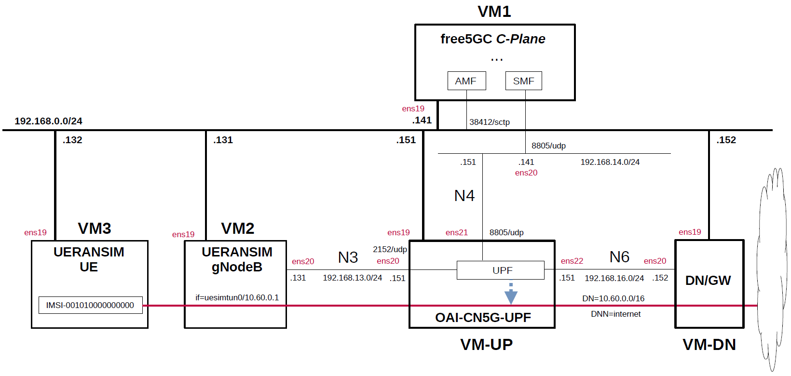

# free5GC 5GC & UERANSIM UE / RAN Sample Configuration - OAI-CN5G-UPF(eBPF/XDP UPF)
This describes a simple configuration for working free5GC and OAI-CN5G-UPF(eBPF/XDP UPF).
In particular, see [here](https://github.com/s5uishida/install_oai_upf) for OAI-CN5G-UPF.

---

### [Sample Configurations and Miscellaneous for Mobile Network](https://github.com/s5uishida/sample_config_misc_for_mobile_network)

---

<a id="toc"></a>

## Table of Contents

- [Overview of free5GC 5GC Simulation Mobile Network](#overview)
- [Changes in configuration files of free5GC 5GC, OAI-CN5G-UPF and UERANSIM UE / RAN](#changes)
  - [Changes in configuration files of free5GC 5GC C-Plane](#changes_cp)
  - [Changes in configuration files of OAI-CN5G-UPF](#changes_up)
  - [Changes in configuration files of UERANSIM UE / RAN](#changes_ueransim)
    - [Changes in configuration files of RAN](#changes_ran)
    - [Changes in configuration files of UE (IMSI-001010000000000)](#changes_ue)
- [Network settings of free5GC 5GC, OAI-CN5G-UPF and UERANSIM UE / RAN](#network_settings)
  - [Network settings of Data Network Gateway](#network_settings_up)
- [Build free5GC, OAI-CN5G-UPF and UERANSIM](#build)
- [Run free5GC 5GC, OAI-CN5G-UPF and UERANSIM UE / RAN](#run)
  - [Run OAI-CN5G-UPF](#run_up)
  - [Run free5GC 5GC C-Plane](#run_cp)
  - [Run UERANSIM](#run_ueran)
    - [Start gNB](#start_gnb)
    - [Start UE](#start_ue)
- [Ping google.com](#ping)
  - [Case for going through DN 10.60.0.0/16](#ping_1)
- [Changelog (summary)](#changelog)

---

<a id="overview"></a>

## Overview of free5GC 5GC Simulation Mobile Network

This describes a simple configuration of C-Plane, eBPF/XDP UPF and Data Network Gateway for free5GC.
**Note that this configuration is implemented with Proxmox VE VMs.**

The following minimum configuration was set as a condition.
- One UPF and Data Network Gateway
- One UE and one DNN

The built simulation environment is as follows.

</img>

The 5GC / eBPF/XDP UPF / UE / RAN used are as follows.
- 5GC - free5GC v4.2.0 (2026.01.14) - https://github.com/free5gc/free5gc
- eBPF/XDP UPF - OAI-CN5G-UPF v2.2.0 (2025.12.13) - https://gitlab.eurecom.fr/oai/cn5g/oai-cn5g-upf
- UE / RAN - UERANSIM v3.2.7 (2025.10.25) - https://github.com/aligungr/UERANSIM

Each VMs are as follows.  
| VM | SW & Role | IP address | OS | CPU<br>(Min) | Mem<br>(Min) | HDD<br>(Min) |
| --- | --- | --- | --- | --- | --- | --- |
| VM1 | free5GC 5GC C-Plane | 192.168.0.141/24 | Ubuntu 24.04 | 1 | 2GB | 20GB |
| VM-UP | OAI-CN5G-UPF U-Plane | 192.168.0.151/24 | Ubuntu 22.04 | 1 | 6GB | 20GB |
| VM-DN | Data Network Gateway  | 192.168.0.152/24 | Ubuntu 24.04 | 1 | 1GB | 10GB |
| VM2 | UERANSIM RAN (gNodeB) | 192.168.0.131/24 | Ubuntu 24.04 | 1 | 1GB | 10GB |
| VM3 | UERANSIM UE | 192.168.0.132/24 | Ubuntu 24.04 | 1 | 1GB | 10GB |

The network interfaces of each VM are as follows.
| VM | Device | Model | Linux Bridge | IP address | Interface | XDP |
| --- | --- | --- | --- | --- | --- | --- |
| VM1 | ens18 | VirtIO | vmbr1 | 10.0.0.141/24 | (NAPT NW) | -- |
| | ens19 | VirtIO | mgbr0 | 192.168.0.141/24 | (Mgmt NW) | -- |
| | ens20 | VirtIO | vmbr4 | 192.168.14.141/24 | N4 | -- |
| VM-UP | ~~ens18~~ | ~~VirtIO~~ | ~~vmbr1~~ | ~~10.0.0.151/24~~ | ~~(NAPT NW)~~ ***down*** | -- |
| | ens19 | VirtIO | mgbr0 | 192.168.0.151/24 | (Mgmt NW) | -- |
| | ens20 | VirtIO | vmbr3 | 192.168.13.151/24 | N3 | x |
| | ens21 | VirtIO | vmbr4 | 192.168.14.151/24 | N4 | -- |
| | ens22 | VirtIO | vmbr6 | 192.168.16.151/24 | N6 | x |
| VM-DN | ens18 | VirtIO | vmbr1 | 10.0.0.152/24 | (NAPT NW) | -- |
| | ens19 | VirtIO | mgbr0 | 192.168.0.152/24 | (Mgmt NW) | -- |
| | ens20 | VirtIO | vmbr6 | 192.168.16.152/24 | N6 | -- |
| VM2 | ens18 | VirtIO | vmbr1 | 10.0.0.131/24 | (NAPT NW) | -- |
| | ens19 | VirtIO | mgbr0 | 192.168.0.131/24 | (Mgmt NW) | -- |
| | ens20 | VirtIO | vmbr3 | 192.168.13.131/24 | N3 | -- |
| VM3 | ens18 | VirtIO | vmbr1 | 10.0.0.132/24 | (NAPT NW) | -- |
| | ens19 | VirtIO | mgbr0 | 192.168.0.132/24 | (Mgmt NW) | -- |

Linux Bridges of Proxmox VE are as follows.
| Linux Bridge | Network CIDR | Interface |
| --- | --- | --- |
| vmbr1 | 10.0.0.0/24 | NAPT NW |
| mgbr0 | 192.168.0.0/24 | Mgmt NW |
| vmbr3 | 192.168.13.0/24 | N3 |
| vmbr4 | 192.168.14.0/24 | N4 |
| vmbr6 | 192.168.16.0/24 | N6 |

Subscriber Information (other information is the same) is as follows.  
**Note. Please select OP or OPc according to the setting of UERANSIM UE configuration file.**
| UE | IMSI | DNN | OP/OPc |
| --- | --- | --- | --- |
| UE | 001010000000000 | internet | OPc |

I registered these information with the free5GC WebUI.
In addition, [3GPP TS 35.208](https://www.3gpp.org/DynaReport/35208.htm) "4.3 Test Sets" is published by 3GPP as test data for the 3GPP authentication and key generation functions (MILENAGE).

The DN is as follows.
| DN | DNN | TUNnel interface of UE |
| --- | --- | --- |
| 10.60.0.0/16 | internet | uesimtun0 |

<a id="changes"></a>

## Changes in configuration files of free5GC 5GC, OAI-CN5G-UPF and UERANSIM UE / RAN

Please refer to the following for building free5GC, OAI-CN5G-UPF and UERANSIM respectively.
- free5GC v4.2.0 (2026.01.14) - https://free5gc.org/guide/
- OAI-CN5G-UPF v2.2.0 (2025.12.13) - https://github.com/s5uishida/install_oai_upf
- UERANSIM v3.2.7 (2025.10.25) - https://github.com/aligungr/UERANSIM/wiki/Installation

<a id="changes_cp"></a>

### Changes in configuration files of free5GC 5GC C-Plane

The combination of DNN and S-NSSAI parameters can be used in the logic that selects UPF as the connection destination by PFCP.

- DNN
- S-NSSAI

For the sake of simplicity, This time, only DNN will be changed. S-NSSAI of all UEs is fixed as `SST=1` and `SD=010203`.

- `free5gc/config/amfcfg.yaml`
```diff
--- amfcfg.yaml.orig    2024-10-13 05:09:24.000000000 +0900
+++ amfcfg.yaml 2025-05-04 19:42:17.462006265 +0900
@@ -5,7 +5,7 @@
 configuration:
   amfName: AMF # the name of this AMF
   ngapIpList:  # the IP list of N2 interfaces on this AMF
-    - 127.0.0.18
+    - 192.168.0.141
   ngapPort: 38412 # the SCTP port listened by NGAP
 
   # Service-based Interface (SBI) Configuration
@@ -30,22 +30,22 @@
   servedGuamiList:
     # <GUAMI> = <MCC><MNC><AMF ID>
     - plmnId: # Public Land Mobile Network ID, <PLMN ID> = <MCC><MNC>
-        mcc: 208 # Mobile Country Code (3 digits string, digit: 0~9)
-        mnc: 93 # Mobile Network Code (2 or 3 digits string, digit: 0~9)
+        mcc: 001 # Mobile Country Code (3 digits string, digit: 0~9)
+        mnc: 01 # Mobile Network Code (2 or 3 digits string, digit: 0~9)
       amfId: cafe00 # AMF identifier (3 bytes hex string, range: 000000~FFFFFF)
 
   # the TAI (Tracking Area Identifier) list supported by this AMF
   supportTaiList:
     - plmnId: # Public Land Mobile Network ID, <PLMN ID> = <MCC><MNC>
-        mcc: 208 # Mobile Country Code (3 digits string, digit: 0~9)
-        mnc: 93 # Mobile Network Code (2 or 3 digits string, digit: 0~9)
+        mcc: 001 # Mobile Country Code (3 digits string, digit: 0~9)
+        mnc: 01 # Mobile Network Code (2 or 3 digits string, digit: 0~9)
       tac: 000001 # Tracking Area Code (3 bytes hex string, range: 000000~FFFFFF)
 
   # the PLMNs (Public land mobile network) list supported by this AMF
   plmnSupportList:
     - plmnId: # Public Land Mobile Network ID, <PLMN ID> = <MCC><MNC>
-        mcc: 208 # Mobile Country Code (3 digits string, digit: 0~9)
-        mnc: 93 # Mobile Network Code (2 or 3 digits string, digit: 0~9)
+        mcc: 001 # Mobile Country Code (3 digits string, digit: 0~9)
+        mnc: 01 # Mobile Network Code (2 or 3 digits string, digit: 0~9)
       snssaiList: # the S-NSSAI (Single Network Slice Selection Assistance Information) list supported by this AMF
         - sst: 1 # Slice/Service Type (uinteger, range: 0~255)
           sd: 010203 # Slice Differentiator (3 bytes hex string, range: 000000~FFFFFF)
```
- `free5gc/config/ausfcfg.yaml`
```diff
--- ausfcfg.yaml.orig   2024-09-01 09:47:28.000000000 +0900
+++ ausfcfg.yaml        2024-09-01 09:55:54.000000000 +0900
@@ -16,10 +16,8 @@
   nrfUri: http://127.0.0.10:8000 # a valid URI of NRF
   nrfCertPem: cert/nrf.pem # NRF Certificate
   plmnSupportList: # the PLMNs (Public Land Mobile Network) list supported by this AUSF
-    - mcc: 208 # Mobile Country Code (3 digits string, digit: 0~9)
-      mnc: 93  # Mobile Network Code (2 or 3 digits string, digit: 0~9)
-    - mcc: 123 # Mobile Country Code (3 digits string, digit: 0~9)
-      mnc: 45  # Mobile Network Code (2 or 3 digits string, digit: 0~9)
+    - mcc: 001 # Mobile Country Code (3 digits string, digit: 0~9)
+      mnc: 01  # Mobile Network Code (2 or 3 digits string, digit: 0~9)
   groupId: ausfGroup001 # ID for the group of the AUSF
   eapAkaSupiImsiPrefix: false # including "imsi-" prefix or not when using the SUPI to do EAP-AKA' authentication

```
- `free5gc/config/nrfcfg.yaml`
```diff
--- nrfcfg.yaml.orig    2024-09-01 09:47:28.000000000 +0900
+++ nrfcfg.yaml 2024-09-01 09:56:10.000000000 +0900
@@ -18,8 +18,8 @@
       key: cert/root.key
     oauth: true
   DefaultPlmnId:
-    mcc: 208 # Mobile Country Code (3 digits string, digit: 0~9)
-    mnc: 93 # Mobile Network Code (2 or 3 digits string, digit: 0~9)
+    mcc: 001 # Mobile Country Code (3 digits string, digit: 0~9)
+    mnc: 01 # Mobile Network Code (2 or 3 digits string, digit: 0~9)
   serviceNameList: # the SBI services provided by this NRF, refer to TS 29.510
     - nnrf-nfm # Nnrf_NFManagement service
     - nnrf-disc # Nnrf_NFDiscovery service
```
- `free5gc/config/nssfcfg.yaml`
```diff
--- nssfcfg.yaml.orig   2024-09-01 09:47:28.000000000 +0900
+++ nssfcfg.yaml        2024-09-01 09:56:46.000000000 +0900
@@ -18,12 +18,12 @@
   nrfUri: http://127.0.0.10:8000 # a valid URI of NRF
   nrfCertPem: cert/nrf.pem # NRF Certificate
   supportedPlmnList: # the PLMNs (Public land mobile network) list supported by this NSSF
-    - mcc: 208 # Mobile Country Code (3 digits string, digit: 0~9)
-      mnc: 93 # Mobile Network Code (2 or 3 digits string, digit: 0~9)
+    - mcc: 001 # Mobile Country Code (3 digits string, digit: 0~9)
+      mnc: 01 # Mobile Network Code (2 or 3 digits string, digit: 0~9)
   supportedNssaiInPlmnList: # Supported S-NSSAI List for each PLMN
     - plmnId: # Public Land Mobile Network ID, <PLMN ID> = <MCC><MNC>
-        mcc: 208 # Mobile Country Code (3 digits string, digit: 0~9)
-        mnc: 93 # Mobile Network Code (2 or 3 digits string, digit: 0~9)
+        mcc: 001 # Mobile Country Code (3 digits string, digit: 0~9)
+        mnc: 01 # Mobile Network Code (2 or 3 digits string, digit: 0~9)
       supportedSnssaiList: # Supported S-NSSAIs of the PLMN
         - sst: 1 # Slice/Service Type (uinteger, range: 0~255)
           sd: 010203 # Slice Differentiator (3 bytes hex string, range: 000000~FFFFFF)
```
- `free5gc/config/smfcfg.yaml`
```diff
--- smfcfg.yaml.orig    2024-10-13 05:09:24.000000000 +0900
+++ smfcfg.yaml 2025-05-04 21:00:46.538990509 +0900
@@ -42,16 +42,16 @@
 
   # Optional: PLMN IDs configuration.
   plmnList:
-    - mcc: 208 # Mobile Country Code (3 digits string, digit: 0~9)
-      mnc: 93 # Mobile Network Code (2 or 3 digits string, digit: 0~9)
+    - mcc: 001 # Mobile Country Code (3 digits string, digit: 0~9)
+      mnc: 01 # Mobile Network Code (2 or 3 digits string, digit: 0~9)
   locality: area1 # Name of the location where a set of AMF, SMF, PCF and UPFs are located
 
   # PFCP (Packet Forwarding Control Protocol) configuration for N4 interface.
   pfcp:
     # addr config is deprecated in smf config v1.0.3, please use the following config
-    nodeID: 127.0.0.1 # the Node ID of this SMF
-    listenAddr: 127.0.0.1 # the IP/FQDN of N4 interface on this SMF (PFCP)
-    externalAddr: 127.0.0.1 # the IP/FQDN of N4 interface on this SMF (PFCP)
+    nodeID: 192.168.14.141 # the Node ID of this SMF
+    listenAddr: 192.168.14.141 # the IP/FQDN of N4 interface on this SMF (PFCP)
+    externalAddr: 192.168.14.141 # the IP/FQDN of N4 interface on this SMF (PFCP)
     assocFailAlertInterval: 10s
     assocFailRetryInterval: 30s
     heartbeatInterval: 10s
@@ -63,8 +63,8 @@
         type: AN # the type of the node (AN or UPF)
       UPF: # the name of the node
         type: UPF # the type of the node (AN or UPF)
-        nodeID: 127.0.0.8 # the Node ID of this UPF
-        addr: 127.0.0.8 # the IP/FQDN of N4 interface on this UPF (PFCP)
+        nodeID: 192.168.14.151 # the Node ID of this UPF
+        addr: 192.168.14.151 # the IP/FQDN of N4 interface on this UPF (PFCP)
         sNssaiUpfInfos: # S-NSSAI information list for this UPF
           - sNssai: # S-NSSAI (Single Network Slice Selection Assistance Information)
               sst: 1 # Slice/Service Type (uinteger, range: 0~255)
@@ -91,7 +91,7 @@
         interfaces: # Interface list for this UPF
           - interfaceType: N3 # the type of the interface (N3 or N9)
             endpoints: # the IP address of this N3/N9 interface on this UPF
-              - 127.0.0.8
+              - 192.168.13.151
             networkInstances: # Data Network Name (DNN)
               - internet
 
@@ -99,7 +99,7 @@
     links:
       - A: gNB1
         B: UPF
-
+  ulcl: false
   # retransmission timer for PDU session modification command
   t3591:
     enable: true # true or false
```

<a id="changes_up"></a>

### Changes in configuration files of OAI-CN5G-UPF

See [here](https://github.com/s5uishida/install_oai_upf#conf) for the original file.

- `openair-upf/config.yaml`  
There is no change.

<a id="changes_ueransim"></a>

### Changes in configuration files of UERANSIM UE / RAN

<a id="changes_ran"></a>

#### Changes in configuration files of RAN

- `UERANSIM/config/free5gc-gnb.yaml`
```diff
--- free5gc-gnb.yaml.orig       2024-12-11 20:31:30.000000000 +0900
+++ free5gc-gnb.yaml    2025-05-04 19:47:48.421731012 +0900
@@ -1,17 +1,17 @@
-mcc: '208'          # Mobile Country Code value
-mnc: '93'           # Mobile Network Code value (2 or 3 digits)
+mcc: '001'          # Mobile Country Code value
+mnc: '01'           # Mobile Network Code value (2 or 3 digits)
 
 nci: '0x000000010'  # NR Cell Identity (36-bit)
 idLength: 32        # NR gNB ID length in bits [22...32]
 tac: 1              # Tracking Area Code
 
-linkIp: 127.0.0.1   # gNB's local IP address for Radio Link Simulation (Usually same with local IP)
-ngapIp: 127.0.0.1   # gNB's local IP address for N2 Interface (Usually same with local IP)
-gtpIp: 127.0.0.1    # gNB's local IP address for N3 Interface (Usually same with local IP)
+linkIp: 192.168.0.131   # gNB's local IP address for Radio Link Simulation (Usually same with local IP)
+ngapIp: 192.168.0.131   # gNB's local IP address for N2 Interface (Usually same with local IP)
+gtpIp: 192.168.13.131    # gNB's local IP address for N3 Interface (Usually same with local IP)
 
 # List of AMF address information
 amfConfigs:
-  - address: 127.0.0.1
+  - address: 192.168.0.141
     port: 38412
 
 # List of supported S-NSSAIs by this gNB
```

<a id="changes_ue"></a>

#### Changes in configuration files of UE (IMSI-001010000000000)

- `UERANSIM/config/free5gc-ue.yaml`
```diff
--- free5gc-ue.yaml.orig        2025-03-16 15:49:12.000000000 +0900
+++ free5gc-ue.yaml     2025-05-04 19:49:27.180000029 +0900
@@ -1,9 +1,9 @@
 # IMSI number of the UE. IMSI = [MCC|MNC|MSISDN] (In total 15 digits)
-supi: 'imsi-208930000000001'
+supi: 'imsi-001010000000000'
 # Mobile Country Code value of HPLMN
-mcc: '208'
+mcc: '001'
 # Mobile Network Code value of HPLMN (2 or 3 digits)
-mnc: '93'
+mnc: '01'
 # SUCI Protection Scheme : 0 for Null-scheme, 1 for Profile A and 2 for Profile B
 protectionScheme: 0
 # Home Network Public Key for protecting with SUCI Profile A
@@ -31,7 +31,7 @@
 
 # List of gNB IP addresses for Radio Link Simulation
 gnbSearchList:
-  - 127.0.0.1
+  - 192.168.0.131
 
 # UAC Access Identities Configuration
 uacAic:
```

<a id="network_settings"></a>

## Network settings of free5GC 5GC, OAI-CN5G-UPF and UERANSIM UE / RAN

<a id="network_settings_up"></a>

### Network settings of Data Network Gateway

See [this](https://github.com/s5uishida/install_oai_upf#setup_dn).

<a id="build"></a>

## Build free5GC, OAI-CN5G-UPF and UERANSIM

Please refer to the following for building free5GC, OAI-CN5G-UPF and UERANSIM respectively.
- free5GC v4.2.0 (2026.01.14) - https://free5gc.org/guide/
- OAI-CN5G-UPF v2.2.0 (2025.12.13) - https://github.com/s5uishida/install_oai_upf
- UERANSIM v3.2.7 (2025.10.25) - https://github.com/aligungr/UERANSIM/wiki/Installation

Install MongoDB on free5GC 5GC C-Plane machine.
[MongoDB Compass](https://www.mongodb.com/products/compass) is a convenient tool to look at the MongoDB database.

**Note. The installation guide also includes instructions on building the latest committed version.**

<a id="run"></a>

## Run free5GC 5GC, OAI-CN5G-UPF and UERANSIM UE / RAN

First run OAI-CN5G-UPF, then the 5GC and UERANSIM (UE & RAN implementation).

<a id="run_up"></a>

### Run OAI-CN5G-UPF

See [this](https://github.com/s5uishida/install_oai_upf#run).

<a id="run_cp"></a>

### Run free5GC 5GC C-Plane

Next, run free5GC 5GC C-Plane.
Create the following shell script and run it.
```bash
#!/usr/bin/env bash

PID_LIST=()

NF_LIST="nrf amf smf udr pcf udm nssf ausf chf nef bsf"

export GIN_MODE=release

for NF in ${NF_LIST}; do
    ./bin/${NF} &
    PID_LIST+=($!)
    sleep 1
done

function terminate()
{
    sudo kill -SIGTERM ${PID_LIST[${#PID_LIST[@]}-2]} ${PID_LIST[${#PID_LIST[@]}-1]}
    sleep 2
}

trap terminate SIGINT
wait ${PID_LIST}
```
The PFCP association log between OAI-CN5G-UPF and free5GC SMF is as follows.
```
[2026-01-18 12:38:47.519] [upf_n4 ] [info] handle_receive(30 bytes)
[2026-01-18 12:38:47.519] [upf_n4 ] [info] Handle SX ASSOCIATION SETUP REQUEST
[2026-01-18 12:38:47.520] [upf_n4 ] [info] handle_receive(16 bytes)
[2026-01-18 12:38:47.520] [upf_n4 ] [info] Received SX HEARTBEAT REQUEST
```

<a id="run_ueran"></a>

### Run UERANSIM

Here, the case of UE (IMSI-001010000000000) & RAN is described.
First, do an NG Setup between gNodeB and 5GC, then register the UE with 5GC and establish a PDU session.

Please refer to the following for usage of UERANSIM.

https://github.com/aligungr/UERANSIM/wiki/Usage

<a id="start_gnb"></a>

#### Start gNB

Start gNB as follows.
```
# ./nr-gnb -c ../config/free5gc-gnb.yaml
UERANSIM v3.2.7
[2026-01-18 12:39:57.409] [sctp] [info] Trying to establish SCTP connection... (192.168.0.141:38412)
[2026-01-18 12:39:57.412] [sctp] [info] SCTP connection established (192.168.0.141:38412)
[2026-01-18 12:39:57.412] [sctp] [debug] SCTP association setup ascId[6]
[2026-01-18 12:39:57.413] [ngap] [debug] Sending NG Setup Request
[2026-01-18 12:39:57.416] [ngap] [debug] NG Setup Response received
[2026-01-18 12:39:57.416] [ngap] [info] NG Setup procedure is successful
```
The free5GC C-Plane log when executed is as follows.
```
2026-01-18T12:39:57.414094568+09:00 [INFO][AMF][Ngap] [AMF] SCTP Accept from: 192.168.0.131:57106
2026-01-18T12:39:57.416026628+09:00 [INFO][AMF][Ngap] Create a new NG connection for: 192.168.0.131:57106
2026-01-18T12:39:57.416378983+09:00 [INFO][AMF][Ngap][ran_addr:192.168.0.131:57106] Handle NGSetupRequest
2026-01-18T12:39:57.417448043+09:00 [INFO][AMF][Ngap][ran_addr:192.168.0.131:57106] Send NG-Setup response
```

<a id="start_ue"></a>

#### Start UE

Start UE as follows. This will register the UE with 5GC and establish a PDU session.
```
# ./nr-ue -c ../config/free5gc-ue.yaml
UERANSIM v3.2.7
[2026-01-18 12:40:27.800] [nas] [info] UE switches to state [MM-DEREGISTERED/PLMN-SEARCH]
[2026-01-18 12:40:27.801] [rrc] [debug] New signal detected for cell[1], total [1] cells in coverage
[2026-01-18 12:40:27.801] [nas] [info] Selected plmn[001/01]
[2026-01-18 12:40:27.801] [rrc] [info] Selected cell plmn[001/01] tac[1] category[SUITABLE]
[2026-01-18 12:40:27.801] [nas] [info] UE switches to state [MM-DEREGISTERED/PS]
[2026-01-18 12:40:27.801] [nas] [info] UE switches to state [MM-DEREGISTERED/NORMAL-SERVICE]
[2026-01-18 12:40:27.801] [nas] [debug] Initial registration required due to [MM-DEREG-NORMAL-SERVICE]
[2026-01-18 12:40:27.801] [nas] [debug] UAC access attempt is allowed for identity[0], category[MO_sig]
[2026-01-18 12:40:27.801] [nas] [debug] Sending Initial Registration
[2026-01-18 12:40:27.801] [rrc] [debug] Sending RRC Setup Request
[2026-01-18 12:40:27.802] [nas] [info] UE switches to state [MM-REGISTER-INITIATED]
[2026-01-18 12:40:27.802] [rrc] [info] RRC connection established
[2026-01-18 12:40:27.802] [rrc] [info] UE switches to state [RRC-CONNECTED]
[2026-01-18 12:40:27.802] [nas] [info] UE switches to state [CM-CONNECTED]
[2026-01-18 12:40:27.853] [nas] [debug] Authentication Request received
[2026-01-18 12:40:27.853] [nas] [debug] Received SQN [000000000029]
[2026-01-18 12:40:27.853] [nas] [debug] SQN-MS [000000000000]
[2026-01-18 12:40:27.881] [nas] [debug] Security Mode Command received
[2026-01-18 12:40:27.881] [nas] [debug] Selected integrity[2] ciphering[0]
[2026-01-18 12:40:28.028] [nas] [debug] Registration accept received
[2026-01-18 12:40:28.028] [nas] [info] UE switches to state [MM-REGISTERED/NORMAL-SERVICE]
[2026-01-18 12:40:28.028] [nas] [debug] Sending Registration Complete
[2026-01-18 12:40:28.028] [nas] [info] Initial Registration is successful
[2026-01-18 12:40:28.028] [nas] [debug] Sending PDU Session Establishment Request
[2026-01-18 12:40:28.029] [nas] [debug] UAC access attempt is allowed for identity[0], category[MO_sig]
[2026-01-18 12:40:28.235] [nas] [debug] Configuration Update Command received
[2026-01-18 12:40:28.401] [nas] [debug] PDU Session Establishment Accept received
[2026-01-18 12:40:28.401] [nas] [info] PDU Session establishment is successful PSI[1]
[2026-01-18 12:40:28.423] [app] [info] Connection setup for PDU session[1] is successful, TUN interface[uesimtun0, 10.60.0.1] is up.
```
The free5GC C-Plane log when executed is as follows.
```
2026-01-18T12:40:27.808771014+09:00 [INFO][AMF][Ngap][ran_addr:192.168.0.131:57106] Handle InitialUEMessage
2026-01-18T12:40:27.808815809+09:00 [INFO][AMF][Ngap][amf_ue_ngap_id:RU:1,AU:1(3GPP)][ran_addr:192.168.0.131:57106] New RanUe [RanUeNgapID:1][AmfUeNgapID:1]
2026-01-18T12:40:27.808857187+09:00 [INFO][AMF][Ngap][ran_addr:192.168.0.131:57106] 5GSMobileIdentity ["SUCI":"suci-0-001-01-0000-0-0-0000000000", err: <nil>]
2026-01-18T12:40:27.808917740+09:00 [INFO][AMF][CTX] New AmfUe [supi:][guti:00101cafe0000000001]
2026-01-18T12:40:27.808940231+09:00 [INFO][AMF][Gmm] Handle event[Gmm Message], transition from [Deregistered] to [Deregistered]
2026-01-18T12:40:27.808945897+09:00 [INFO][AMF][Gmm][amf_ue_ngap_id:RU:1,AU:1(3GPP)][supi:SUPI:] Handle Registration Request
2026-01-18T12:40:27.808952137+09:00 [INFO][AMF][Gmm][amf_ue_ngap_id:RU:1,AU:1(3GPP)][supi:SUPI:] RegistrationType: Initial Registration
2026-01-18T12:40:27.808958657+09:00 [INFO][AMF][Gmm][amf_ue_ngap_id:RU:1,AU:1(3GPP)][supi:SUPI:] MobileIdentity5GS: SUCI[suci-0-001-01-0000-0-0-0000000000]
2026-01-18T12:40:27.808968777+09:00 [INFO][AMF][Gmm] Handle event[Start Authentication], transition from [Deregistered] to [Authentication]
2026-01-18T12:40:27.808975207+09:00 [INFO][AMF][Gmm][amf_ue_ngap_id:RU:1,AU:1(3GPP)][supi:SUPI:] Authentication procedure
2026-01-18T12:40:27.809823893+09:00 [INFO][NRF][Token] In HTTPAccessTokenRequest
2026-01-18T12:40:27.812196183+09:00 [WARN][NRF][Token] Certificate verify: x509: certificate signed by unknown authority (possibly because of "x509: invalid signature: parent certificate cannot sign this kind of certificate" while trying to verify candidate authority certificate "free5gc")
2026-01-18T12:40:27.816192154+09:00 [INFO][NRF][GIN] | 200 |       127.0.0.1 | POST    | /oauth2/token |  |
2026-01-18T12:40:27.817437095+09:00 [INFO][NRF][DISC] Handle NFDiscoveryRequest
2026-01-18T12:40:27.818670314+09:00 [INFO][NRF][GIN] | 200 |       127.0.0.1 | GET     | /nnrf-disc/v1/nf-instances?requester-nf-type=AMF&target-nf-type=AUSF |  |
2026-01-18T12:40:27.819720945+09:00 [INFO][NRF][Token] In HTTPAccessTokenRequest
2026-01-18T12:40:27.821220302+09:00 [WARN][NRF][Token] Certificate verify: x509: certificate signed by unknown authority (possibly because of "x509: invalid signature: parent certificate cannot sign this kind of certificate" while trying to verify candidate authority certificate "free5gc")
2026-01-18T12:40:27.823756926+09:00 [INFO][NRF][GIN] | 200 |       127.0.0.1 | POST    | /oauth2/token |  |
2026-01-18T12:40:27.825477201+09:00 [INFO][AUSF][UeAuth] HandleUeAuthPostRequest
2026-01-18T12:40:27.825662111+09:00 [INFO][AUSF][UeAuth] Serving network authorized
2026-01-18T12:40:27.826420933+09:00 [INFO][NRF][Token] In HTTPAccessTokenRequest
2026-01-18T12:40:27.827473977+09:00 [WARN][NRF][Token] Certificate verify: x509: certificate signed by unknown authority (possibly because of "x509: invalid signature: parent certificate cannot sign this kind of certificate" while trying to verify candidate authority certificate "free5gc")
2026-01-18T12:40:27.829509206+09:00 [INFO][NRF][GIN] | 200 |       127.0.0.1 | POST    | /oauth2/token |  |
2026-01-18T12:40:27.830335360+09:00 [INFO][NRF][DISC] Handle NFDiscoveryRequest
2026-01-18T12:40:27.831217981+09:00 [INFO][NRF][GIN] | 200 |       127.0.0.1 | GET     | /nnrf-disc/v1/nf-instances?requester-nf-type=AUSF&service-names=nudm-ueau&target-nf-type=UDM |  |
2026-01-18T12:40:27.832256132+09:00 [INFO][NRF][Token] In HTTPAccessTokenRequest
2026-01-18T12:40:27.833211048+09:00 [WARN][NRF][Token] Certificate verify: x509: certificate signed by unknown authority (possibly because of "x509: invalid signature: parent certificate cannot sign this kind of certificate" while trying to verify candidate authority certificate "free5gc")
2026-01-18T12:40:27.836163879+09:00 [INFO][NRF][GIN] | 200 |       127.0.0.1 | POST    | /oauth2/token |  |
2026-01-18T12:40:27.838185941+09:00 [INFO][UDM][UEAU] Handle GenerateAuthDataRequest
2026-01-18T12:40:27.839356637+09:00 [INFO][NRF][Token] In HTTPAccessTokenRequest
2026-01-18T12:40:27.841506580+09:00 [WARN][NRF][Token] Certificate verify: x509: certificate signed by unknown authority (possibly because of "x509: invalid signature: parent certificate cannot sign this kind of certificate" while trying to verify candidate authority certificate "free5gc")
2026-01-18T12:40:27.845484010+09:00 [INFO][NRF][GIN] | 200 |       127.0.0.1 | POST    | /oauth2/token |  |
2026-01-18T12:40:27.845991958+09:00 [INFO][UDM][Suci] scheme 0
2026-01-18T12:40:27.846233478+09:00 [INFO][UDM][Suci] SUPI type is IMSI
2026-01-18T12:40:27.846630613+09:00 [INFO][NRF][Token] In HTTPAccessTokenRequest
2026-01-18T12:40:27.847879280+09:00 [WARN][NRF][Token] Certificate verify: x509: certificate signed by unknown authority (possibly because of "x509: invalid signature: parent certificate cannot sign this kind of certificate" while trying to verify candidate authority certificate "free5gc")
2026-01-18T12:40:27.850002957+09:00 [INFO][NRF][GIN] | 200 |       127.0.0.1 | POST    | /oauth2/token |  |
2026-01-18T12:40:27.850800977+09:00 [INFO][NRF][DISC] Handle NFDiscoveryRequest
2026-01-18T12:40:27.851657157+09:00 [INFO][NRF][GIN] | 200 |       127.0.0.1 | GET     | /nnrf-disc/v1/nf-instances?requester-nf-type=UDM&target-nf-type=UDR |  |
2026-01-18T12:40:27.854386537+09:00 [INFO][UDR][GIN] | 200 |       127.0.0.1 | GET     | /nudr-dr/v2/subscription-data/imsi-001010000000000/authentication-data/authentication-subscription |  |
2026-01-18T12:40:27.854970677+09:00 [INFO][UDM][Proc] ModifyAuthenticationSubscriptionRequest:  [{replace /sequenceNumber  { 00000000002a map[] 0 }}]
2026-01-18T12:40:27.856985177+09:00 [INFO][UDR][GIN] | 204 |       127.0.0.1 | PATCH   | /nudr-dr/v2/subscription-data/imsi-001010000000000/authentication-data/authentication-subscription |  |
2026-01-18T12:40:27.857340868+09:00 [INFO][UDM][GIN] | 200 |       127.0.0.1 | POST    | /nudm-ueau/v1/suci-0-001-01-0000-0-0-0000000000/security-information/generate-auth-data |  |
2026-01-18T12:40:27.857812144+09:00 [INFO][AUSF][UeAuth] Add SuciSupiPair (suci-0-001-01-0000-0-0-0000000000, imsi-001010000000000) to map.
2026-01-18T12:40:27.857923662+09:00 [INFO][AUSF][UeAuth] Use 5G AKA auth method
2026-01-18T12:40:27.857965704+09:00 [INFO][AUSF][5gAka] XresStar = 3833336564663735633061343132636364643437306365373037656136386364
2026-01-18T12:40:27.858169438+09:00 [INFO][AUSF][GIN] | 201 |       127.0.0.1 | POST    | /nausf-auth/v1/ue-authentications |  |
2026-01-18T12:40:27.858785211+09:00 [INFO][AMF][Gmm][amf_ue_ngap_id:RU:1,AU:1(3GPP)][supi:SUPI:] Send Authentication Request
2026-01-18T12:40:27.858948976+09:00 [INFO][AMF][Ngap][amf_ue_ngap_id:RU:1,AU:1(3GPP)][ran_addr:192.168.0.131:57106] Send Downlink Nas Transport
2026-01-18T12:40:27.859138350+09:00 [INFO][AMF][Gmm][amf_ue_ngap_id:RU:1,AU:1(3GPP)][supi:SUPI:] Start T3560 timer
2026-01-18T12:40:27.860173080+09:00 [INFO][AMF][Ngap][ran_addr:192.168.0.131:57106] Handle UplinkNASTransport
2026-01-18T12:40:27.860284329+09:00 [INFO][AMF][Ngap][amf_ue_ngap_id:RU:1,AU:1(3GPP)][ran_addr:192.168.0.131:57106] Handle UplinkNASTransport (RAN UE NGAP ID: 1)
2026-01-18T12:40:27.860486288+09:00 [INFO][AMF][Gmm] Handle event[Gmm Message], transition from [Authentication] to [Authentication]
2026-01-18T12:40:27.860571636+09:00 [INFO][AMF][Gmm][amf_ue_ngap_id:RU:1,AU:1(3GPP)][supi:SUPI:] Handle Authentication Response
2026-01-18T12:40:27.860592915+09:00 [INFO][AMF][Gmm][amf_ue_ngap_id:RU:1,AU:1(3GPP)][supi:SUPI:] Stop T3560 timer
2026-01-18T12:40:27.863499234+09:00 [INFO][NRF][Token] In HTTPAccessTokenRequest
2026-01-18T12:40:27.865404785+09:00 [WARN][NRF][Token] Certificate verify: x509: certificate signed by unknown authority (possibly because of "x509: invalid signature: parent certificate cannot sign this kind of certificate" while trying to verify candidate authority certificate "free5gc")
2026-01-18T12:40:27.869507984+09:00 [INFO][NRF][GIN] | 200 |       127.0.0.1 | POST    | /oauth2/token |  |
2026-01-18T12:40:27.871940781+09:00 [INFO][AUSF][5gAka] Auth5gAkaComfirmRequest
2026-01-18T12:40:27.871957858+09:00 [INFO][AUSF][5gAka] res*: 3833336564663735633061343132636364643437306365373037656136386364
Xres*: 3833336564663735633061343132636364643437306365373037656136386364
2026-01-18T12:40:27.871963748+09:00 [INFO][AUSF][5gAka] 5G AKA confirmation succeeded
2026-01-18T12:40:27.872904115+09:00 [INFO][NRF][Token] In HTTPAccessTokenRequest
2026-01-18T12:40:27.873896470+09:00 [WARN][NRF][Token] Certificate verify: x509: certificate signed by unknown authority (possibly because of "x509: invalid signature: parent certificate cannot sign this kind of certificate" while trying to verify candidate authority certificate "free5gc")
2026-01-18T12:40:27.876704507+09:00 [INFO][NRF][GIN] | 200 |       127.0.0.1 | POST    | /oauth2/token |  |
2026-01-18T12:40:27.878307672+09:00 [INFO][UDM][UEAU] Handle ConfirmAuthDataRequest
2026-01-18T12:40:27.879138796+09:00 [INFO][NRF][Token] In HTTPAccessTokenRequest
2026-01-18T12:40:27.880361213+09:00 [WARN][NRF][Token] Certificate verify: x509: certificate signed by unknown authority (possibly because of "x509: invalid signature: parent certificate cannot sign this kind of certificate" while trying to verify candidate authority certificate "free5gc")
2026-01-18T12:40:27.883065659+09:00 [INFO][NRF][GIN] | 200 |       127.0.0.1 | POST    | /oauth2/token |  |
2026-01-18T12:40:27.885232732+09:00 [INFO][UDR][GIN] | 204 |       127.0.0.1 | PUT     | /nudr-dr/v2/subscription-data/imsi-001010000000000/authentication-data/authentication-status |  |
2026-01-18T12:40:27.885592080+09:00 [INFO][UDM][GIN] | 201 |       127.0.0.1 | POST    | /nudm-ueau/v1/imsi-001010000000000/auth-events |  |
2026-01-18T12:40:27.885967628+09:00 [INFO][AUSF][GIN] | 200 |       127.0.0.1 | PUT     | /nausf-auth/v1/ue-authentications/suci-0-001-01-0000-0-0-0000000000/5g-aka-confirmation |  |
2026-01-18T12:40:27.886466006+09:00 [INFO][AMF][Gmm] Handle event[Authentication Success], transition from [Authentication] to [SecurityMode]
2026-01-18T12:40:27.886786388+09:00 [INFO][AMF][Gmm][amf_ue_ngap_id:RU:1,AU:1(3GPP)][supi:SUPI:imsi-001010000000000] Send Security Mode Command
2026-01-18T12:40:27.886962590+09:00 [INFO][AMF][Ngap][amf_ue_ngap_id:RU:1,AU:1(3GPP)][ran_addr:192.168.0.131:57106] Send Downlink Nas Transport
2026-01-18T12:40:27.887192125+09:00 [INFO][AMF][Gmm][amf_ue_ngap_id:RU:1,AU:1(3GPP)][supi:SUPI:imsi-001010000000000] Start T3560 timer
2026-01-18T12:40:27.888107918+09:00 [INFO][AMF][Ngap][ran_addr:192.168.0.131:57106] Handle UplinkNASTransport
2026-01-18T12:40:27.888211770+09:00 [INFO][AMF][Ngap][amf_ue_ngap_id:RU:1,AU:1(3GPP)][ran_addr:192.168.0.131:57106] Handle UplinkNASTransport (RAN UE NGAP ID: 1)
2026-01-18T12:40:27.888371922+09:00 [INFO][AMF][Gmm] Handle event[Gmm Message], transition from [SecurityMode] to [SecurityMode]
2026-01-18T12:40:27.888412906+09:00 [INFO][AMF][Gmm][amf_ue_ngap_id:RU:1,AU:1(3GPP)][supi:SUPI:imsi-001010000000000] Handle Security Mode Complete
2026-01-18T12:40:27.888447905+09:00 [INFO][AMF][Gmm][amf_ue_ngap_id:RU:1,AU:1(3GPP)][supi:SUPI:imsi-001010000000000] Stop T3560 timer
2026-01-18T12:40:27.888612531+09:00 [INFO][AMF][Gmm] Handle event[SecurityMode Success], transition from [SecurityMode] to [ContextSetup]
2026-01-18T12:40:27.888653685+09:00 [INFO][AMF][Gmm][amf_ue_ngap_id:RU:1,AU:1(3GPP)][supi:SUPI:imsi-001010000000000] Handle InitialRegistration
2026-01-18T12:40:27.889452463+09:00 [INFO][NRF][Token] In HTTPAccessTokenRequest
2026-01-18T12:40:27.890879232+09:00 [WARN][NRF][Token] Certificate verify: x509: certificate signed by unknown authority (possibly because of "x509: invalid signature: parent certificate cannot sign this kind of certificate" while trying to verify candidate authority certificate "free5gc")
2026-01-18T12:40:27.892856198+09:00 [INFO][NRF][GIN] | 200 |       127.0.0.1 | POST    | /oauth2/token |  |
2026-01-18T12:40:27.893643024+09:00 [INFO][NRF][DISC] Handle NFDiscoveryRequest
2026-01-18T12:40:27.894723218+09:00 [INFO][NRF][GIN] | 200 |       127.0.0.1 | GET     | /nnrf-disc/v1/nf-instances?requester-nf-type=AMF&supi=imsi-001010000000000&target-nf-type=UDM |  |
2026-01-18T12:40:27.895361940+09:00 [INFO][NRF][Token] In HTTPAccessTokenRequest
2026-01-18T12:40:27.896709208+09:00 [WARN][NRF][Token] Certificate verify: x509: certificate signed by unknown authority (possibly because of "x509: invalid signature: parent certificate cannot sign this kind of certificate" while trying to verify candidate authority certificate "free5gc")
2026-01-18T12:40:27.899554220+09:00 [INFO][NRF][GIN] | 200 |       127.0.0.1 | POST    | /oauth2/token |  |
2026-01-18T12:40:27.900779496+09:00 [INFO][UDM][Consumer] TwoLayerPathHandlerFunc,  imsi-001010000000000 nssai
2026-01-18T12:40:27.901040616+09:00 [INFO][UDM][SDM] Handle GetNssai
2026-01-18T12:40:27.901877255+09:00 [INFO][NRF][Token] In HTTPAccessTokenRequest
2026-01-18T12:40:27.902955473+09:00 [WARN][NRF][Token] Certificate verify: x509: certificate signed by unknown authority (possibly because of "x509: invalid signature: parent certificate cannot sign this kind of certificate" while trying to verify candidate authority certificate "free5gc")
2026-01-18T12:40:27.905963504+09:00 [INFO][NRF][GIN] | 200 |       127.0.0.1 | POST    | /oauth2/token |  |
2026-01-18T12:40:27.907346710+09:00 [INFO][UDR][DataRepo] QueryAmDataProcedure: ueId: imsi-001010000000000, servingPlmnId: 00101
2026-01-18T12:40:27.907978883+09:00 [INFO][UDR][GIN] | 200 |       127.0.0.1 | GET     | /nudr-dr/v2/subscription-data/imsi-001010000000000/00101/provisioned-data/am-data?supported-features= |  |
2026-01-18T12:40:27.908911804+09:00 [INFO][UDM][GIN] | 200 |       127.0.0.1 | GET     | /nudm-sdm/v2/imsi-001010000000000/nssai?plmn-id=%7B%22mcc%22%3A%22001%22%2C%22mnc%22%3A%2201%22%7D |  |
2026-01-18T12:40:27.909454583+09:00 [INFO][AMF][Gmm] RequestedNssai: &{Iei:47 Len:5 Buffer:[4 1 1 2 3]}
2026-01-18T12:40:27.909631663+09:00 [INFO][AMF][Gmm][amf_ue_ngap_id:RU:1,AU:1(3GPP)][supi:SUPI:imsi-001010000000000] RequestedNssai - ServingSnssai: &{Sst:1 Sd:010203}, HomeSnssai: <nil>
2026-01-18T12:40:27.910624372+09:00 [INFO][NRF][Token] In HTTPAccessTokenRequest
2026-01-18T12:40:27.912049561+09:00 [WARN][NRF][Token] Certificate verify: x509: certificate signed by unknown authority (possibly because of "x509: invalid signature: parent certificate cannot sign this kind of certificate" while trying to verify candidate authority certificate "free5gc")
2026-01-18T12:40:27.914188302+09:00 [INFO][NRF][GIN] | 200 |       127.0.0.1 | POST    | /oauth2/token |  |
2026-01-18T12:40:27.914925539+09:00 [INFO][NRF][DISC] Handle NFDiscoveryRequest
2026-01-18T12:40:27.916068283+09:00 [INFO][NRF][GIN] | 200 |       127.0.0.1 | GET     | /nnrf-disc/v1/nf-instances?requester-nf-type=AMF&supi=imsi-001010000000000&target-nf-type=UDM |  |
2026-01-18T12:40:27.916856157+09:00 [INFO][NRF][Token] In HTTPAccessTokenRequest
2026-01-18T12:40:27.919182652+09:00 [WARN][NRF][Token] Certificate verify: x509: certificate signed by unknown authority (possibly because of "x509: invalid signature: parent certificate cannot sign this kind of certificate" while trying to verify candidate authority certificate "free5gc")
2026-01-18T12:40:27.923008535+09:00 [INFO][NRF][GIN] | 200 |       127.0.0.1 | POST    | /oauth2/token |  |
2026-01-18T12:40:27.926115221+09:00 [INFO][UDM][UECM] Handle RegistrationAmf3gppAccess
2026-01-18T12:40:27.926288594+09:00 [INFO][UDM][UECM] UEID: imsi-001010000000000
2026-01-18T12:40:27.927144506+09:00 [INFO][NRF][Token] In HTTPAccessTokenRequest
2026-01-18T12:40:27.928324655+09:00 [WARN][NRF][Token] Certificate verify: x509: certificate signed by unknown authority (possibly because of "x509: invalid signature: parent certificate cannot sign this kind of certificate" while trying to verify candidate authority certificate "free5gc")
2026-01-18T12:40:27.930964240+09:00 [INFO][NRF][GIN] | 200 |       127.0.0.1 | POST    | /oauth2/token |  |
2026-01-18T12:40:27.933385331+09:00 [INFO][UDR][GIN] | 204 |       127.0.0.1 | PUT     | /nudr-dr/v2/subscription-data/imsi-001010000000000/context-data/amf-3gpp-access |  |
2026-01-18T12:40:27.933675777+09:00 [INFO][UDM][GIN] | 201 |       127.0.0.1 | PUT     | /nudm-uecm/v1/imsi-001010000000000/registrations/amf-3gpp-access |  |
2026-01-18T12:40:27.934909242+09:00 [INFO][NRF][Token] In HTTPAccessTokenRequest
2026-01-18T12:40:27.936319651+09:00 [WARN][NRF][Token] Certificate verify: x509: certificate signed by unknown authority (possibly because of "x509: invalid signature: parent certificate cannot sign this kind of certificate" while trying to verify candidate authority certificate "free5gc")
2026-01-18T12:40:27.939261882+09:00 [INFO][NRF][GIN] | 200 |       127.0.0.1 | POST    | /oauth2/token |  |
2026-01-18T12:40:27.940349976+09:00 [INFO][UDM][Consumer] TwoLayerPathHandlerFunc,  imsi-001010000000000 am-data
2026-01-18T12:40:27.940642218+09:00 [INFO][UDM][SDM] Handle GetAmData
2026-01-18T12:40:27.941385686+09:00 [INFO][NRF][Token] In HTTPAccessTokenRequest
2026-01-18T12:40:27.942479712+09:00 [WARN][NRF][Token] Certificate verify: x509: certificate signed by unknown authority (possibly because of "x509: invalid signature: parent certificate cannot sign this kind of certificate" while trying to verify candidate authority certificate "free5gc")
2026-01-18T12:40:27.945214684+09:00 [INFO][NRF][GIN] | 200 |       127.0.0.1 | POST    | /oauth2/token |  |
2026-01-18T12:40:27.946232012+09:00 [INFO][UDR][DataRepo] QueryAmDataProcedure: ueId: imsi-001010000000000, servingPlmnId: 00101
2026-01-18T12:40:27.947050071+09:00 [INFO][UDR][GIN] | 200 |       127.0.0.1 | GET     | /nudr-dr/v2/subscription-data/imsi-001010000000000/00101/provisioned-data/am-data?supported-features= |  |
2026-01-18T12:40:27.947419678+09:00 [INFO][UDM][GIN] | 200 |       127.0.0.1 | GET     | /nudm-sdm/v2/imsi-001010000000000/am-data?plmn-id=%7B%22mcc%22%3A%22001%22%2C%22mnc%22%3A%2201%22%7D |  |
2026-01-18T12:40:27.949238832+09:00 [INFO][NRF][Token] In HTTPAccessTokenRequest
2026-01-18T12:40:27.950679076+09:00 [WARN][NRF][Token] Certificate verify: x509: certificate signed by unknown authority (possibly because of "x509: invalid signature: parent certificate cannot sign this kind of certificate" while trying to verify candidate authority certificate "free5gc")
2026-01-18T12:40:27.953408112+09:00 [INFO][NRF][GIN] | 200 |       127.0.0.1 | POST    | /oauth2/token |  |
2026-01-18T12:40:27.954487557+09:00 [INFO][UDM][Consumer] TwoLayerPathHandlerFunc,  imsi-001010000000000 smf-select-data
2026-01-18T12:40:27.954544321+09:00 [INFO][UDM][SDM] Handle GetSmfSelectData
2026-01-18T12:40:27.955352759+09:00 [INFO][NRF][Token] In HTTPAccessTokenRequest
2026-01-18T12:40:27.956554372+09:00 [WARN][NRF][Token] Certificate verify: x509: certificate signed by unknown authority (possibly because of "x509: invalid signature: parent certificate cannot sign this kind of certificate" while trying to verify candidate authority certificate "free5gc")
2026-01-18T12:40:27.959066302+09:00 [INFO][NRF][GIN] | 200 |       127.0.0.1 | POST    | /oauth2/token |  |
2026-01-18T12:40:27.960728032+09:00 [INFO][UDR][GIN] | 200 |       127.0.0.1 | GET     | /nudr-dr/v2/subscription-data/imsi-001010000000000/00101/provisioned-data/smf-selection-subscription-data?supported-features= |  |
2026-01-18T12:40:27.961272081+09:00 [INFO][UDM][GIN] | 200 |       127.0.0.1 | GET     | /nudm-sdm/v2/imsi-001010000000000/smf-select-data?plmn-id=%7B%22mcc%22%3A%22001%22%2C%22mnc%22%3A%2201%22%7D |  |
2026-01-18T12:40:27.962460370+09:00 [INFO][NRF][Token] In HTTPAccessTokenRequest
2026-01-18T12:40:27.963851351+09:00 [WARN][NRF][Token] Certificate verify: x509: certificate signed by unknown authority (possibly because of "x509: invalid signature: parent certificate cannot sign this kind of certificate" while trying to verify candidate authority certificate "free5gc")
2026-01-18T12:40:27.966716364+09:00 [INFO][NRF][GIN] | 200 |       127.0.0.1 | POST    | /oauth2/token |  |
2026-01-18T12:40:27.967913935+09:00 [INFO][UDM][Consumer] TwoLayerPathHandlerFunc,  imsi-001010000000000 ue-context-in-smf-data
2026-01-18T12:40:27.968063366+09:00 [INFO][UDM][SDM] Handle GetUeContextInSmfData
2026-01-18T12:40:27.968775769+09:00 [INFO][NRF][Token] In HTTPAccessTokenRequest
2026-01-18T12:40:27.969947420+09:00 [WARN][NRF][Token] Certificate verify: x509: certificate signed by unknown authority (possibly because of "x509: invalid signature: parent certificate cannot sign this kind of certificate" while trying to verify candidate authority certificate "free5gc")
2026-01-18T12:40:27.972389967+09:00 [INFO][NRF][GIN] | 200 |       127.0.0.1 | POST    | /oauth2/token |  |
2026-01-18T12:40:27.974879922+09:00 [INFO][UDR][GIN] | 200 |       127.0.0.1 | GET     | /nudr-dr/v2/subscription-data/imsi-001010000000000/context-data/smf-registrations?supported-features= |  |
2026-01-18T12:40:27.975648835+09:00 [INFO][UDM][GIN] | 200 |       127.0.0.1 | GET     | /nudm-sdm/v2/imsi-001010000000000/ue-context-in-smf-data |  |
2026-01-18T12:40:27.978510706+09:00 [INFO][NRF][Token] In HTTPAccessTokenRequest
2026-01-18T12:40:27.979690193+09:00 [WARN][NRF][Token] Certificate verify: x509: certificate signed by unknown authority (possibly because of "x509: invalid signature: parent certificate cannot sign this kind of certificate" while trying to verify candidate authority certificate "free5gc")
2026-01-18T12:40:27.982298154+09:00 [INFO][NRF][GIN] | 200 |       127.0.0.1 | POST    | /oauth2/token |  |
2026-01-18T12:40:27.984445743+09:00 [INFO][UDM][Consumer] TwoLayerPathHandlerFunc,  imsi-001010000000000 sdm-subscriptions
2026-01-18T12:40:27.985456539+09:00 [INFO][UDM][SDM] Handle Subscribe
2026-01-18T12:40:27.986063540+09:00 [INFO][NRF][Token] In HTTPAccessTokenRequest
2026-01-18T12:40:27.987013991+09:00 [WARN][NRF][Token] Certificate verify: x509: certificate signed by unknown authority (possibly because of "x509: invalid signature: parent certificate cannot sign this kind of certificate" while trying to verify candidate authority certificate "free5gc")
2026-01-18T12:40:27.989460408+09:00 [INFO][NRF][GIN] | 200 |       127.0.0.1 | POST    | /oauth2/token |  |
2026-01-18T12:40:27.992540661+09:00 [INFO][UDR][GIN] | 201 |       127.0.0.1 | POST    | /nudr-dr/v2/subscription-data/imsi-001010000000000/context-data/sdm-subscriptions |  |
2026-01-18T12:40:27.992900875+09:00 [INFO][UDM][GIN] | 201 |       127.0.0.1 | POST    | /nudm-sdm/v2/imsi-001010000000000/sdm-subscriptions |  |
2026-01-18T12:40:27.993833282+09:00 [INFO][NRF][Token] In HTTPAccessTokenRequest
2026-01-18T12:40:27.995195250+09:00 [WARN][NRF][Token] Certificate verify: x509: certificate signed by unknown authority (possibly because of "x509: invalid signature: parent certificate cannot sign this kind of certificate" while trying to verify candidate authority certificate "free5gc")
2026-01-18T12:40:27.997048736+09:00 [INFO][NRF][GIN] | 200 |       127.0.0.1 | POST    | /oauth2/token |  |
2026-01-18T12:40:27.997750783+09:00 [INFO][NRF][DISC] Handle NFDiscoveryRequest
2026-01-18T12:40:27.998779218+09:00 [INFO][NRF][GIN] | 200 |       127.0.0.1 | GET     | /nnrf-disc/v1/nf-instances?preferred-locality=area1&requester-nf-type=AMF&supi=imsi-001010000000000&target-nf-type=PCF |  |
2026-01-18T12:40:27.999340268+09:00 [INFO][NRF][Token] In HTTPAccessTokenRequest
2026-01-18T12:40:28.001862196+09:00 [WARN][NRF][Token] Certificate verify: x509: certificate signed by unknown authority (possibly because of "x509: invalid signature: parent certificate cannot sign this kind of certificate" while trying to verify candidate authority certificate "free5gc")
2026-01-18T12:40:28.004678801+09:00 [INFO][NRF][GIN] | 200 |       127.0.0.1 | POST    | /oauth2/token |  |
2026-01-18T12:40:28.006420791+09:00 [INFO][PCF][AmPol] Handle AM Policy Create Request
2026-01-18T12:40:28.007386417+09:00 [INFO][NRF][Token] In HTTPAccessTokenRequest
2026-01-18T12:40:28.008431528+09:00 [WARN][NRF][Token] Certificate verify: x509: certificate signed by unknown authority (possibly because of "x509: invalid signature: parent certificate cannot sign this kind of certificate" while trying to verify candidate authority certificate "free5gc")
2026-01-18T12:40:28.010346304+09:00 [INFO][NRF][GIN] | 200 |       127.0.0.1 | POST    | /oauth2/token |  |
2026-01-18T12:40:28.011100273+09:00 [INFO][NRF][DISC] Handle NFDiscoveryRequest
2026-01-18T12:40:28.011797393+09:00 [INFO][NRF][GIN] | 200 |       127.0.0.1 | GET     | /nnrf-disc/v1/nf-instances?requester-nf-type=PCF&target-nf-type=UDR |  |
2026-01-18T12:40:28.012720088+09:00 [INFO][NRF][Token] In HTTPAccessTokenRequest
2026-01-18T12:40:28.013758468+09:00 [WARN][NRF][Token] Certificate verify: x509: certificate signed by unknown authority (possibly because of "x509: invalid signature: parent certificate cannot sign this kind of certificate" while trying to verify candidate authority certificate "free5gc")
2026-01-18T12:40:28.016069145+09:00 [INFO][NRF][GIN] | 200 |       127.0.0.1 | POST    | /oauth2/token |  |
2026-01-18T12:40:28.017666966+09:00 [INFO][UDR][GIN] | 200 |       127.0.0.1 | GET     | /nudr-dr/v2/policy-data/ues/imsi-001010000000000/am-data |  |
2026-01-18T12:40:28.018589884+09:00 [INFO][NRF][Token] In HTTPAccessTokenRequest
2026-01-18T12:40:28.019816723+09:00 [WARN][NRF][Token] Certificate verify: x509: certificate signed by unknown authority (possibly because of "x509: invalid signature: parent certificate cannot sign this kind of certificate" while trying to verify candidate authority certificate "free5gc")
2026-01-18T12:40:28.021716481+09:00 [INFO][NRF][GIN] | 200 |       127.0.0.1 | POST    | /oauth2/token |  |
2026-01-18T12:40:28.022336762+09:00 [INFO][NRF][DISC] Handle NFDiscoveryRequest
2026-01-18T12:40:28.023382849+09:00 [INFO][NRF][GIN] | 200 |       127.0.0.1 | GET     | /nnrf-disc/v1/nf-instances?guami=%7B%22plmnId%22%3A%7B%22mcc%22%3A%22001%22%2C%22mnc%22%3A%2201%22%7D%2C%22amfId%22%3A%22cafe00%22%7D&requester-nf-type=PCF&target-nf-type=AMF |  |
2026-01-18T12:40:28.024274471+09:00 [INFO][NRF][Token] In HTTPAccessTokenRequest
2026-01-18T12:40:28.026284980+09:00 [WARN][NRF][Token] Certificate verify: x509: certificate signed by unknown authority (possibly because of "x509: invalid signature: parent certificate cannot sign this kind of certificate" while trying to verify candidate authority certificate "free5gc")
2026-01-18T12:40:28.029924500+09:00 [INFO][NRF][GIN] | 200 |       127.0.0.1 | POST    | /oauth2/token |  |
2026-01-18T12:40:28.031961551+09:00 [INFO][AMF][Comm] Handle AMF Status Change Subscribe Request
2026-01-18T12:40:28.032266812+09:00 [INFO][AMF][Comm] new AMF Status Subscription[1]
2026-01-18T12:40:28.032506781+09:00 [INFO][AMF][GIN] | 201 |       127.0.0.1 | POST    | /namf-comm/v1/subscriptions |  |
2026-01-18T12:40:28.033020164+09:00 [INFO][PCF][GIN] | 201 |       127.0.0.1 | POST    | /npcf-am-policy-control/v1/policies |  |
2026-01-18T12:40:28.033600921+09:00 [INFO][AMF][Gmm][amf_ue_ngap_id:RU:1,AU:1(3GPP)][supi:SUPI:imsi-001010000000000] Send Registration Accept
2026-01-18T12:40:28.033779289+09:00 [INFO][AMF][Ngap][amf_ue_ngap_id:RU:1,AU:1(3GPP)][ran_addr:192.168.0.131:57106] Send Initial Context Setup Request
2026-01-18T12:40:28.033990371+09:00 [INFO][AMF][Gmm][amf_ue_ngap_id:RU:1,AU:1(3GPP)][supi:SUPI:imsi-001010000000000] Start T3550 timer
2026-01-18T12:40:28.035794202+09:00 [INFO][AMF][Ngap][ran_addr:192.168.0.131:57106] Handle InitialContextSetupResponse
2026-01-18T12:40:28.037361516+09:00 [INFO][AMF][Ngap][amf_ue_ngap_id:RU:1,AU:1(3GPP)][ran_addr:192.168.0.131:57106] Handle InitialContextSetupResponse (RAN UE NGAP ID: 1)
2026-01-18T12:40:28.240912952+09:00 [INFO][AMF][Ngap][ran_addr:192.168.0.131:57106] Handle UplinkNASTransport
2026-01-18T12:40:28.240929845+09:00 [INFO][AMF][Ngap][amf_ue_ngap_id:RU:1,AU:1(3GPP)][ran_addr:192.168.0.131:57106] Handle UplinkNASTransport (RAN UE NGAP ID: 1)
2026-01-18T12:40:28.240969113+09:00 [INFO][AMF][Gmm] Handle event[Gmm Message], transition from [ContextSetup] to [ContextSetup]
2026-01-18T12:40:28.240976015+09:00 [INFO][AMF][Gmm][amf_ue_ngap_id:RU:1,AU:1(3GPP)][supi:SUPI:imsi-001010000000000] Handle Registration Complete
2026-01-18T12:40:28.240981585+09:00 [INFO][AMF][Gmm][amf_ue_ngap_id:RU:1,AU:1(3GPP)][supi:SUPI:imsi-001010000000000] Stop T3550 timer
2026-01-18T12:40:28.241000362+09:00 [INFO][AMF][Gmm][amf_ue_ngap_id:RU:1,AU:1(3GPP)][supi:SUPI:imsi-001010000000000] Send Configuration Update Command
2026-01-18T12:40:28.241007442+09:00 [INFO][AMF][Ngap][amf_ue_ngap_id:RU:1,AU:1(3GPP)][ran_addr:192.168.0.131:57106] Send Downlink Nas Transport
2026-01-18T12:40:28.241057298+09:00 [INFO][AMF][Gmm] Handle event[ContextSetup Success], transition from [ContextSetup] to [Registered]
2026-01-18T12:40:28.241108905+09:00 [INFO][AMF][Ngap][ran_addr:192.168.0.131:57106] Handle UplinkNASTransport
2026-01-18T12:40:28.241115918+09:00 [INFO][AMF][Ngap][amf_ue_ngap_id:RU:1,AU:1(3GPP)][ran_addr:192.168.0.131:57106] Handle UplinkNASTransport (RAN UE NGAP ID: 1)
2026-01-18T12:40:28.241140517+09:00 [INFO][AMF][Gmm] Handle event[Gmm Message], transition from [Registered] to [Registered]
2026-01-18T12:40:28.241146984+09:00 [INFO][AMF][Gmm][amf_ue_ngap_id:RU:1,AU:1(3GPP)][supi:SUPI:imsi-001010000000000] Handle UL NAS Transport
2026-01-18T12:40:28.241151685+09:00 [INFO][AMF][Gmm][amf_ue_ngap_id:RU:1,AU:1(3GPP)][supi:SUPI:imsi-001010000000000] Transport 5GSM Message to SMF
2026-01-18T12:40:28.241159757+09:00 [INFO][AMF][Gmm][amf_ue_ngap_id:RU:1,AU:1(3GPP)][supi:SUPI:imsi-001010000000000] Select SMF [snssai: {Sst:1 Sd:010203}, dnn: internet]
2026-01-18T12:40:28.242037963+09:00 [INFO][NRF][Token] In HTTPAccessTokenRequest
2026-01-18T12:40:28.243410140+09:00 [WARN][NRF][Token] Certificate verify: x509: certificate signed by unknown authority (possibly because of "x509: invalid signature: parent certificate cannot sign this kind of certificate" while trying to verify candidate authority certificate "free5gc")
2026-01-18T12:40:28.245626831+09:00 [INFO][NRF][GIN] | 200 |       127.0.0.1 | POST    | /oauth2/token |  |
2026-01-18T12:40:28.246402638+09:00 [INFO][NRF][DISC] Handle NFDiscoveryRequest
2026-01-18T12:40:28.247341105+09:00 [INFO][NRF][GIN] | 200 |       127.0.0.1 | GET     | /nnrf-disc/v1/nf-instances?requester-nf-type=AMF&target-nf-type=NSSF |  |
2026-01-18T12:40:28.247984800+09:00 [INFO][NRF][Token] In HTTPAccessTokenRequest
2026-01-18T12:40:28.249319125+09:00 [WARN][NRF][Token] Certificate verify: x509: certificate signed by unknown authority (possibly because of "x509: invalid signature: parent certificate cannot sign this kind of certificate" while trying to verify candidate authority certificate "free5gc")
2026-01-18T12:40:28.252002017+09:00 [INFO][NRF][GIN] | 200 |       127.0.0.1 | POST    | /oauth2/token |  |
2026-01-18T12:40:28.253469492+09:00 [INFO][NSSF][NsSel] Handle NSSelectionGet
2026-01-18T12:40:28.253928164+09:00 [WARN][NSSF][Util] No TA {"plmnId":{"mcc":"001","mnc":"01"},"tac":"000001"} in NSSF configuration
2026-01-18T12:40:28.254232146+09:00 [INFO][NSSF][GIN] | 200 |       127.0.0.1 | GET     | /nnssf-nsselection/v2/network-slice-information?nf-id=723488f6-d020-4dc3-907e-ea89b77e6c47&nf-type=AMF&slice-info-request-for-pdu-session=%7B%22sNssai%22%3A%7B%22sst%22%3A1%2C%22sd%22%3A%22010203%22%7D%2C%22roamingIndication%22%3A%22NON_ROAMING%22%7D&tai=%7B%22plmnId%22%3A%7B%22mcc%22%3A%22001%22%2C%22mnc%22%3A%2201%22%7D%2C%22tac%22%3A%22000001%22%7D |  |
2026-01-18T12:40:28.254772838+09:00 [WARN][AMF][Gmm][amf_ue_ngap_id:RU:1,AU:1(3GPP)][supi:SUPI:imsi-001010000000000] nsiInformation is still nil, use default NRF[http://127.0.0.10:8000]
2026-01-18T12:40:28.255587967+09:00 [INFO][NRF][Token] In HTTPAccessTokenRequest
2026-01-18T12:40:28.256971469+09:00 [WARN][NRF][Token] Certificate verify: x509: certificate signed by unknown authority (possibly because of "x509: invalid signature: parent certificate cannot sign this kind of certificate" while trying to verify candidate authority certificate "free5gc")
2026-01-18T12:40:28.258992396+09:00 [INFO][NRF][GIN] | 200 |       127.0.0.1 | POST    | /oauth2/token |  |
2026-01-18T12:40:28.259737444+09:00 [INFO][NRF][DISC] Handle NFDiscoveryRequest
2026-01-18T12:40:28.260963136+09:00 [INFO][NRF][GIN] | 200 |       127.0.0.1 | GET     | /nnrf-disc/v1/nf-instances?dnn=internet&preferred-locality=area1&requester-nf-type=AMF&service-names=nsmf-pdusession&snssais=%5B%7B%22sst%22%3A1%2C%22sd%22%3A%22010203%22%7D%5D&target-nf-type=SMF&target-plmn-list=%5B%7B%22mcc%22%3A%22001%22%2C%22mnc%22%3A%2201%22%7D%5D |  |
2026-01-18T12:40:28.261575556+09:00 [INFO][NRF][Token] In HTTPAccessTokenRequest
2026-01-18T12:40:28.262744474+09:00 [WARN][NRF][Token] Certificate verify: x509: certificate signed by unknown authority (possibly because of "x509: invalid signature: parent certificate cannot sign this kind of certificate" while trying to verify candidate authority certificate "free5gc")
2026-01-18T12:40:28.265460707+09:00 [INFO][NRF][GIN] | 200 |       127.0.0.1 | POST    | /oauth2/token |  |
2026-01-18T12:40:28.267922546+09:00 [INFO][SMF][PduSess] Receive Create SM Context Request
2026-01-18T12:40:28.269676944+09:00 [INFO][SMF][PduSess] In HandlePDUSessionSMContextCreate
2026-01-18T12:40:28.269864122+09:00 [INFO][SMF][CTX] UrrPeriod: 30s
2026-01-18T12:40:28.269907311+09:00 [INFO][SMF][CTX] UrrThreshold: 500000
2026-01-18T12:40:28.273090695+09:00 [INFO][NRF][Token] In HTTPAccessTokenRequest
2026-01-18T12:40:28.274275253+09:00 [WARN][NRF][Token] Certificate verify: x509: certificate signed by unknown authority (possibly because of "x509: invalid signature: parent certificate cannot sign this kind of certificate" while trying to verify candidate authority certificate "free5gc")
2026-01-18T12:40:28.276449316+09:00 [INFO][NRF][GIN] | 200 |       127.0.0.1 | POST    | /oauth2/token |  |
2026-01-18T12:40:28.277254067+09:00 [INFO][NRF][DISC] Handle NFDiscoveryRequest
2026-01-18T12:40:28.278325845+09:00 [INFO][NRF][GIN] | 200 |       127.0.0.1 | GET     | /nnrf-disc/v1/nf-instances?requester-nf-type=SMF&target-nf-type=UDM |  |
2026-01-18T12:40:28.279124871+09:00 [INFO][SMF][PduSess][pdu_session_id:1][supi:imsi-001010000000000] Send NF Discovery Serving UDM Successfully
2026-01-18T12:40:28.279471717+09:00 [INFO][NRF][Token] In HTTPAccessTokenRequest
2026-01-18T12:40:28.280647950+09:00 [WARN][NRF][Token] Certificate verify: x509: certificate signed by unknown authority (possibly because of "x509: invalid signature: parent certificate cannot sign this kind of certificate" while trying to verify candidate authority certificate "free5gc")
2026-01-18T12:40:28.283425228+09:00 [INFO][NRF][GIN] | 200 |       127.0.0.1 | POST    | /oauth2/token |  |
2026-01-18T12:40:28.284739978+09:00 [INFO][UDM][Consumer] TwoLayerPathHandlerFunc,  imsi-001010000000000 sm-data
2026-01-18T12:40:28.285022026+09:00 [INFO][UDM][SDM] Handle GetSmData
2026-01-18T12:40:28.285815568+09:00 [INFO][NRF][Token] In HTTPAccessTokenRequest
2026-01-18T12:40:28.286985007+09:00 [WARN][NRF][Token] Certificate verify: x509: certificate signed by unknown authority (possibly because of "x509: invalid signature: parent certificate cannot sign this kind of certificate" while trying to verify candidate authority certificate "free5gc")
2026-01-18T12:40:28.289539946+09:00 [INFO][NRF][GIN] | 200 |       127.0.0.1 | POST    | /oauth2/token |  |
2026-01-18T12:40:28.289891179+09:00 [INFO][UDM][SDM] getSmDataProcedure: SUPI[imsi-001010000000000] PLMNID[00101] DNN[internet] SNssai[{"sst":1,"sd":"010203"}]
2026-01-18T12:40:28.291424707+09:00 [INFO][UDR][GIN] | 200 |       127.0.0.1 | GET     | /nudr-dr/v2/subscription-data/imsi-001010000000000/00101/provisioned-data/sm-data?single-nssai=%7B%22sst%22%3A1%2C%22sd%22%3A%22010203%22%7D |  |
2026-01-18T12:40:28.291883085+09:00 [INFO][UDM][GIN] | 200 |       127.0.0.1 | GET     | /nudm-sdm/v2/imsi-001010000000000/sm-data?dnn=internet&plmn-id=%7B%22mcc%22%3A%22001%22%2C%22mnc%22%3A%2201%22%7D&single-nssai=%7B%22sst%22%3A1%2C%22sd%22%3A%22010203%22%7D |  |
2026-01-18T12:40:28.292877740+09:00 [INFO][SMF][GSM] In HandlePDUSessionEstablishmentRequest
2026-01-18T12:40:28+09:00 [INFO][NAS][Convert] ProtocolOrContainerList:  [0xc000616960 0xc000616980]
2026-01-18T12:40:28.293305163+09:00 [INFO][SMF][GSM] Protocol Configuration Options
2026-01-18T12:40:28.293460869+09:00 [INFO][SMF][GSM] &{[0xc000616960 0xc000616980]}
2026-01-18T12:40:28.293642551+09:00 [INFO][SMF][GSM] Didn't Implement container type IPAddressAllocationViaNASSignallingUL
2026-01-18T12:40:28.294512650+09:00 [INFO][NRF][Token] In HTTPAccessTokenRequest
2026-01-18T12:40:28.295683627+09:00 [WARN][NRF][Token] Certificate verify: x509: certificate signed by unknown authority (possibly because of "x509: invalid signature: parent certificate cannot sign this kind of certificate" while trying to verify candidate authority certificate "free5gc")
2026-01-18T12:40:28.297833227+09:00 [INFO][NRF][GIN] | 200 |       127.0.0.1 | POST    | /oauth2/token |  |
2026-01-18T12:40:28.298571470+09:00 [INFO][NRF][DISC] Handle NFDiscoveryRequest
2026-01-18T12:40:28.299942342+09:00 [INFO][NRF][GIN] | 200 |       127.0.0.1 | GET     | /nnrf-disc/v1/nf-instances?requester-nf-type=SMF&target-nf-instance-id=723488f6-d020-4dc3-907e-ea89b77e6c47&target-nf-type=AMF |  |
2026-01-18T12:40:28.300344893+09:00 [INFO][SMF][Consumer] SendNFDiscoveryServingAMF ok
2026-01-18T12:40:28.300500918+09:00 [INFO][SMF][CTX] Allocated UE IP address: 10.60.0.1
2026-01-18T12:40:28.300656684+09:00 [INFO][SMF][CTX] Selected UPF: UPF
2026-01-18T12:40:28.300731028+09:00 [INFO][SMF][PduSess][pdu_session_id:1][supi:imsi-001010000000000] Allocated PDUAdress[10.60.0.1]
2026-01-18T12:40:28.301032243+09:00 [INFO][NRF][Token] In HTTPAccessTokenRequest
2026-01-18T12:40:28.302404429+09:00 [WARN][NRF][Token] Certificate verify: x509: certificate signed by unknown authority (possibly because of "x509: invalid signature: parent certificate cannot sign this kind of certificate" while trying to verify candidate authority certificate "free5gc")
2026-01-18T12:40:28.306004587+09:00 [INFO][NRF][GIN] | 200 |       127.0.0.1 | POST    | /oauth2/token |  |
2026-01-18T12:40:28.307969663+09:00 [INFO][NRF][DISC] Handle NFDiscoveryRequest
2026-01-18T12:40:28.308764305+09:00 [INFO][NRF][GIN] | 200 |       127.0.0.1 | GET     | /nnrf-disc/v1/nf-instances?requester-nf-type=SMF&target-nf-type=BSF |  |
2026-01-18T12:40:28.309748242+09:00 [INFO][BSF][Proc] Handle GetPCFBindings
[GIN] 2026/01/18 - 12:40:28 | 200 |     395.938µs |       127.0.0.1 | GET      "/nbsf-management/v1/pcfBindings?dnn=internet&snssai=%7B%22sst%22%3A1%2C%22sd%22%3A%22010203%22%7D&supi=imsi-001010000000000"
2026-01-18T12:40:28.310664871+09:00 [INFO][SMF][Consumer] Found existing PCF binding for SUPI: imsi-001010000000000, DNN: internet
2026-01-18T12:40:28.310964991+09:00 [INFO][SMF][Consumer] Using existing PCF from BSF binding: 47a4f7dd-a150-46b0-9e08-b71636c90d73
2026-01-18T12:40:28.311708735+09:00 [INFO][NRF][Token] In HTTPAccessTokenRequest
2026-01-18T12:40:28.312703560+09:00 [WARN][NRF][Token] Certificate verify: x509: certificate signed by unknown authority (possibly because of "x509: invalid signature: parent certificate cannot sign this kind of certificate" while trying to verify candidate authority certificate "free5gc")
2026-01-18T12:40:28.314794599+09:00 [INFO][NRF][GIN] | 200 |       127.0.0.1 | POST    | /oauth2/token |  |
2026-01-18T12:40:28.315567083+09:00 [INFO][NRF][DISC] Handle NFDiscoveryRequest
2026-01-18T12:40:28.316130366+09:00 [INFO][NRF][GIN] | 200 |       127.0.0.1 | GET     | /nnrf-disc/v1/nf-instances?requester-nf-type=SMF&target-nf-instance-id=47a4f7dd-a150-46b0-9e08-b71636c90d73&target-nf-type=PCF |  |
2026-01-18T12:40:28.316443486+09:00 [WARN][SMF][Consumer] Failed to discover PCF 47a4f7dd-a150-46b0-9e08-b71636c90d73 from NRF, falling back to general PCF selection: <nil>
2026-01-18T12:40:28.316752705+09:00 [INFO][NRF][Token] In HTTPAccessTokenRequest
2026-01-18T12:40:28.317862637+09:00 [WARN][NRF][Token] Certificate verify: x509: certificate signed by unknown authority (possibly because of "x509: invalid signature: parent certificate cannot sign this kind of certificate" while trying to verify candidate authority certificate "free5gc")
2026-01-18T12:40:28.319732889+09:00 [INFO][NRF][GIN] | 200 |       127.0.0.1 | POST    | /oauth2/token |  |
2026-01-18T12:40:28.320406748+09:00 [INFO][NRF][DISC] Handle NFDiscoveryRequest
2026-01-18T12:40:28.321576210+09:00 [INFO][NRF][GIN] | 200 |       127.0.0.1 | GET     | /nnrf-disc/v1/nf-instances?preferred-locality=area1&requester-nf-type=SMF&target-nf-type=PCF |  |
2026-01-18T12:40:28.322282957+09:00 [INFO][NRF][Token] In HTTPAccessTokenRequest
2026-01-18T12:40:28.323314890+09:00 [WARN][NRF][Token] Certificate verify: x509: certificate signed by unknown authority (possibly because of "x509: invalid signature: parent certificate cannot sign this kind of certificate" while trying to verify candidate authority certificate "free5gc")
2026-01-18T12:40:28.326204078+09:00 [INFO][NRF][GIN] | 200 |       127.0.0.1 | POST    | /oauth2/token |  |
2026-01-18T12:40:28.327992721+09:00 [INFO][PCF][SMpolicy] Handle CreateSmPolicy
2026-01-18T12:40:28.328716560+09:00 [INFO][NRF][Token] In HTTPAccessTokenRequest
2026-01-18T12:40:28.329951305+09:00 [WARN][NRF][Token] Certificate verify: x509: certificate signed by unknown authority (possibly because of "x509: invalid signature: parent certificate cannot sign this kind of certificate" while trying to verify candidate authority certificate "free5gc")
2026-01-18T12:40:28.332684208+09:00 [INFO][NRF][GIN] | 200 |       127.0.0.1 | POST    | /oauth2/token |  |
2026-01-18T12:40:28.334928134+09:00 [INFO][UDR][GIN] | 200 |       127.0.0.1 | GET     | /nudr-dr/v2/policy-data/ues/imsi-001010000000000/sm-data?dnn=internet&snssai=%7B%22sst%22%3A1%2C%22sd%22%3A%22010203%22%7D |  |
2026-01-18T12:40:28.339629705+09:00 [INFO][NRF][Token] In HTTPAccessTokenRequest
2026-01-18T12:40:28.340716404+09:00 [WARN][NRF][Token] Certificate verify: x509: certificate signed by unknown authority (possibly because of "x509: invalid signature: parent certificate cannot sign this kind of certificate" while trying to verify candidate authority certificate "free5gc")
2026-01-18T12:40:28.343434387+09:00 [INFO][NRF][GIN] | 200 |       127.0.0.1 | POST    | /oauth2/token |  |
2026-01-18T12:40:28.345199863+09:00 [INFO][UDR][GIN] | 200 |       127.0.0.1 | GET     | /nudr-dr/v2/application-data/influenceData?dnns=internet&snssais=%5B%7B%22sst%22%3A1%2C%22sd%22%3A%22010203%22%7D%5D&supis=imsi-001010000000000 |  |
2026-01-18T12:40:28.345497697+09:00 [INFO][PCF][SMpolicy] Matched [0] trafficInfluDatas from UDR
2026-01-18T12:40:28.346223401+09:00 [INFO][NRF][Token] In HTTPAccessTokenRequest
2026-01-18T12:40:28.347512228+09:00 [WARN][NRF][Token] Certificate verify: x509: certificate signed by unknown authority (possibly because of "x509: invalid signature: parent certificate cannot sign this kind of certificate" while trying to verify candidate authority certificate "free5gc")
2026-01-18T12:40:28.350015508+09:00 [INFO][NRF][GIN] | 200 |       127.0.0.1 | POST    | /oauth2/token |  |
2026-01-18T12:40:28.351428939+09:00 [INFO][UDR][GIN] | 201 |       127.0.0.1 | POST    | /nudr-dr/v2/application-data/influenceData/subs-to-notify |  |
2026-01-18T12:40:28.352418519+09:00 [INFO][NRF][Token] In HTTPAccessTokenRequest
2026-01-18T12:40:28.353852577+09:00 [WARN][NRF][Token] Certificate verify: x509: certificate signed by unknown authority (possibly because of "x509: invalid signature: parent certificate cannot sign this kind of certificate" while trying to verify candidate authority certificate "free5gc")
2026-01-18T12:40:28.355966298+09:00 [INFO][NRF][GIN] | 200 |       127.0.0.1 | POST    | /oauth2/token |  |
2026-01-18T12:40:28.356626508+09:00 [INFO][NRF][DISC] Handle NFDiscoveryRequest
2026-01-18T12:40:28.357379309+09:00 [INFO][NRF][GIN] | 200 |       127.0.0.1 | GET     | /nnrf-disc/v1/nf-instances?requester-nf-type=PCF&target-nf-type=BSF |  |
2026-01-18T12:40:28.358265399+09:00 [INFO][BSF][Proc] Handle CreatePCFBinding
[GIN] 2026/01/18 - 12:40:28 | 403 |     410.005µs |       127.0.0.1 | POST     "/nbsf-management/v1/pcfBindings"
2026-01-18T12:40:28.359092828+09:00 [WARN][PCF][SMpolicy] Failed to register PCF binding in BSF: unexpected response status: 403
2026-01-18T12:40:28.360013900+09:00 [INFO][PCF][GIN] | 201 |       127.0.0.1 | POST    | /npcf-smpolicycontrol/v1/sm-policies |  |
2026-01-18T12:40:28.361239541+09:00 [INFO][SMF][PduSess] CHF Selection for SMContext SUPI[imsi-001010000000000] PDUSessionID[1]
2026-01-18T12:40:28.362097245+09:00 [INFO][NRF][Token] In HTTPAccessTokenRequest
2026-01-18T12:40:28.363225765+09:00 [WARN][NRF][Token] Certificate verify: x509: certificate signed by unknown authority (possibly because of "x509: invalid signature: parent certificate cannot sign this kind of certificate" while trying to verify candidate authority certificate "free5gc")
2026-01-18T12:40:28.365252589+09:00 [INFO][NRF][GIN] | 200 |       127.0.0.1 | POST    | /oauth2/token |  |
2026-01-18T12:40:28.365978666+09:00 [INFO][NRF][DISC] Handle NFDiscoveryRequest
2026-01-18T12:40:28.366518154+09:00 [INFO][NRF][GIN] | 200 |       127.0.0.1 | GET     | /nnrf-disc/v1/nf-instances?requester-nf-type=SMF&target-nf-type=CHF |  |
2026-01-18T12:40:28.366864797+09:00 [INFO][SMF][Charging] Handle SendConvergedChargingRequest
2026-01-18T12:40:28.367254980+09:00 [INFO][NRF][Token] In HTTPAccessTokenRequest
2026-01-18T12:40:28.369098146+09:00 [WARN][NRF][Token] Certificate verify: x509: certificate signed by unknown authority (possibly because of "x509: invalid signature: parent certificate cannot sign this kind of certificate" while trying to verify candidate authority certificate "free5gc")
2026-01-18T12:40:28.373501631+09:00 [INFO][NRF][GIN] | 200 |       127.0.0.1 | POST    | /oauth2/token |  |
2026-01-18T12:40:28.379434890+09:00 [INFO][CHF][ChargingPost] HandleChargingdataInitial
2026-01-18T12:40:28.379627034+09:00 [INFO][CHF][ChargingPost] SMF charging event
2026-01-18T12:40:28.379876540+09:00 [ERRO][CHF][ChargingPost] Charging gateway fail to send CDR to billing domain dial tcp 127.0.0.1:2121: connect: connection refused
2026-01-18T12:40:28.379994561+09:00 [INFO][CHF][ChargingPost] Open CDR for UE imsi-001010000000000
2026-01-18T12:40:28.380083985+09:00 [INFO][CHF][ChargingPost] NewChfUe imsi-001010000000000
2026-01-18T12:40:28.380573408+09:00 [INFO][CHF][GIN] | 201 |       127.0.0.1 | POST    | /nchf-convergedcharging/v3/chargingdata |  |
2026-01-18T12:40:28.381213348+09:00 [INFO][SMF][Charging] Send Charging Data Request[Init] successfully
2026-01-18T12:40:28.381455224+09:00 [INFO][SMF][PduSess][pdu_session_id:1][supi:imsi-001010000000000] Install PCCRule[PccRuleId-1]
2026-01-18T12:40:28.381471187+09:00 [INFO][SMF][PduSess][pdu_session_id:1][supi:imsi-001010000000000] No srcTcData and tgtTcData. Nothing to do
2026-01-18T12:40:28.381600605+09:00 [INFO][SMF][PduSess][pdu_session_id:1][supi:imsi-001010000000000] Install PCCRule[PccRuleId-2]
2026-01-18T12:40:28.381677767+09:00 [INFO][SMF][PduSess][pdu_session_id:1][supi:imsi-001010000000000] No srcTcData and tgtTcData. Nothing to do
2026-01-18T12:40:28.381991573+09:00 [INFO][SMF][PduSess][pdu_session_id:1][supi:imsi-001010000000000] Has default path
2026-01-18T12:40:28.384204133+09:00 [INFO][SMF][PduSess] Sending PFCP Session Establishment Request
2026-01-18T12:40:28.385934840+09:00 [INFO][UDM][Consumer] TwoLayerPathHandlerFunc,  imsi-001010000000000 sdm-subscriptions
2026-01-18T12:40:28.386007189+09:00 [INFO][UDM][SDM] Handle Subscribe
2026-01-18T12:40:28.386817750+09:00 [INFO][NRF][Token] In HTTPAccessTokenRequest
2026-01-18T12:40:28.388768838+09:00 [WARN][NRF][Token] Certificate verify: x509: certificate signed by unknown authority (possibly because of "x509: invalid signature: parent certificate cannot sign this kind of certificate" while trying to verify candidate authority certificate "free5gc")
2026-01-18T12:40:28.391795034+09:00 [INFO][SMF][PduSess] Received PFCP Session Establishment Accepted Response
2026-01-18T12:40:28.394220420+09:00 [INFO][NRF][GIN] | 200 |       127.0.0.1 | POST    | /oauth2/token |  |
2026-01-18T12:40:28.394627924+09:00 [INFO][NRF][Token] In HTTPAccessTokenRequest
2026-01-18T12:40:28.396017757+09:00 [WARN][NRF][Token] Certificate verify: x509: certificate signed by unknown authority (possibly because of "x509: invalid signature: parent certificate cannot sign this kind of certificate" while trying to verify candidate authority certificate "free5gc")
2026-01-18T12:40:28.397889733+09:00 [INFO][UDR][GIN] | 201 |       127.0.0.1 | POST    | /nudr-dr/v2/subscription-data/imsi-001010000000000/context-data/sdm-subscriptions |  |
2026-01-18T12:40:28.399004180+09:00 [INFO][UDM][GIN] | 201 |       127.0.0.1 | POST    | /nudm-sdm/v2/imsi-001010000000000/sdm-subscriptions |  |
2026-01-18T12:40:28.399765266+09:00 [INFO][SMF][PduSess] SDM Subscription Successful UE: imsi-001010000000000 SubscriptionId: 2
2026-01-18T12:40:28.400101448+09:00 [INFO][SMF][GIN] | 201 |       127.0.0.1 | POST    | /nsmf-pdusession/v1/sm-contexts |  |
2026-01-18T12:40:28.401156004+09:00 [INFO][AMF][Gmm][amf_ue_ngap_id:RU:1,AU:1(3GPP)][supi:SUPI:imsi-001010000000000] create smContext[pduSessionID: 1] Success
2026-01-18T12:40:28.403195385+09:00 [INFO][NRF][GIN] | 200 |       127.0.0.1 | POST    | /oauth2/token |  |
2026-01-18T12:40:28.405207217+09:00 [INFO][AMF][Producer] Handle N1N2 Message Transfer Request
2026-01-18T12:40:28.405403863+09:00 [INFO][AMF][Ngap][amf_ue_ngap_id:RU:1,AU:1(3GPP)][ran_addr:192.168.0.131:57106] Send PDU Session Resource Setup Request
2026-01-18T12:40:28.405645556+09:00 [INFO][AMF][GIN] | 200 |       127.0.0.1 | POST    | /namf-comm/v1/ue-contexts/imsi-001010000000000/n1-n2-messages |  |
2026-01-18T12:40:28.407580777+09:00 [INFO][AMF][Ngap][ran_addr:192.168.0.131:57106] Handle PDUSessionResourceSetupResponse
2026-01-18T12:40:28.407756370+09:00 [INFO][AMF][Ngap][ran_addr:192.168.0.131:57106] Not comprehended IE ID 0x0079 (criticality: ignore)
2026-01-18T12:40:28.407921421+09:00 [INFO][AMF][Ngap][amf_ue_ngap_id:RU:1,AU:1(3GPP)][ran_addr:192.168.0.131:57106] Handle PDUSessionResourceSetupResponse (RAN UE NGAP ID: 1)
2026-01-18T12:40:28.408755634+09:00 [INFO][NRF][Token] In HTTPAccessTokenRequest
2026-01-18T12:40:28.410215734+09:00 [WARN][NRF][Token] Certificate verify: x509: certificate signed by unknown authority (possibly because of "x509: invalid signature: parent certificate cannot sign this kind of certificate" while trying to verify candidate authority certificate "free5gc")
2026-01-18T12:40:28.413339417+09:00 [INFO][NRF][GIN] | 200 |       127.0.0.1 | POST    | /oauth2/token |  |
2026-01-18T12:40:28.414883992+09:00 [INFO][SMF][PduSess] Receive Update SM Context Request
2026-01-18T12:40:28.510735658+09:00 [INFO][SMF][PduSess] Received PFCP Session Modification Accepted Response from AN UPF
2026-01-18T12:40:28.510909070+09:00 [INFO][SMF][GIN] | 200 |       127.0.0.1 | POST    | /nsmf-pdusession/v1/sm-contexts/urn:uuid:e904e3ab-441f-4113-aeff-ec9fb8e6249b/modify |  |
```
The PDU session establishment log of OAI-CN5G-UPF is as follows.
```
[2026-01-18 12:40:28.419] [upf_n4 ] [info] handle_receive(1105 bytes)
[2026-01-18 12:40:28.419] [upf_app] [info] Received N4_SESSION_ESTABLISHMENT_REQUEST seid 0x0 
[2026-01-18 12:40:28.419] [upf_n4 ] [info] pfcp_session::add(far) seid 0x1 
[2026-01-18 12:40:28.419] [upf_n4 ] [info] pfcp_session::add(far) seid 0x1 
[2026-01-18 12:40:28.419] [upf_n4 ] [info] pfcp_session::add(far) seid 0x1 
[2026-01-18 12:40:28.419] [upf_n4 ] [info] pfcp_session::add(far) seid 0x1 
[2026-01-18 12:40:28.419] [upf_n4 ] [info] pfcp_session::add(qer) seid 0x1 
[2026-01-18 12:40:28.419] [upf_n4 ] [info] TEID received from CP
[2026-01-18 12:40:28.419] [upf_n4 ] [info] pfcp_session::set(fteid) seid 0x1 
[2026-01-18 12:40:28.419] [upf_n4 ] [info] pfcp_session::get(fteid) seid 0x1 
[2026-01-18 12:40:28.419] [upf_n4 ] [info] pfcp_session::add(pdr) seid 0x1 
[2026-01-18 12:40:28.419] [upf_n4 ] [info] pfcp_session::add(qer) seid 0x1 
[2026-01-18 12:40:28.419] [upf_n4 ] [info] pfcp_session::add(pdr) seid 0x1 
[2026-01-18 12:40:28.419] [upf_n4 ] [info] pfcp_session::add(qer) seid 0x1 
[2026-01-18 12:40:28.419] [upf_n4 ] [info] TEID received from CP
[2026-01-18 12:40:28.419] [upf_n4 ] [info] pfcp_session::set(fteid) seid 0x1 
[2026-01-18 12:40:28.419] [upf_n4 ] [info] pfcp_session::get(fteid) seid 0x1 
[2026-01-18 12:40:28.419] [upf_n4 ] [info] pfcp_session::add(pdr) seid 0x1 
[2026-01-18 12:40:28.419] [upf_n4 ] [info] pfcp_session::add(qer) seid 0x1 
[2026-01-18 12:40:28.419] [upf_n4 ] [info] pfcp_session::add(pdr) seid 0x1 
[2026-01-18 12:40:28.419] [upf_app] [info] Establish datapath: create(pdr(s) & far(s))
[2026-01-18 12:40:28.419] [upf_app] [info] SEID 0x1: Processing 4 PDRs (Uplink: 2, Downlink: 2) in precedence order
[2026-01-18 12:40:28.419] [upf_app] [warning] FTEID is missing for PDR 4. CH bit: Not Set
[2026-01-18 12:40:28.419] [upf_app] [warning] FTEID is missing for PDR 2. CH bit: Not Set
[2026-01-18 12:40:28.419] [upf_app] [info] SEID 0x1: Loaded 4 PDRs into BPF map in precedence order
[2026-01-18 12:40:28.419] [upf_app] [info]   >> Writing to BPF m_session_pdrs map with key SEID=1 (0x1)
[2026-01-18 12:40:28.450] [upf_n4 ] [info] handle_receive(442 bytes)
[2026-01-18 12:40:28.456] [upf_app] [info] Received N4_SESSION_MODIFICATION_REQUEST seid 0x1 
[2026-01-18 12:40:28.456] [pfcp_switch] [warning] TODO check carrefully update fseid in PFCP_SESSION_MODIFICATION_REQUEST
[2026-01-18 12:40:28.456] [upf_app] [info] Modify datapath
[2026-01-18 12:40:28.456] [upf_app] [info] BPFProgram 2 is created!!!
[2026-01-18 12:40:28.456] [upf_app] [info] Initializing QER TC BPF program...
[2026-01-18 12:40:28.457] [upf_app] [info] UDP_INTERFACE = ens22
[2026-01-18 12:40:28.457] [upf_app] [info] GTP_INTERFACE = ens20
[2026-01-18 12:40:28.464] [upf_app] [info] Create PDU Session Class 1:1 with rate: -1000
RTNETLINK answers: File exists
[2026-01-18 12:40:28.466] [upf_app] [error] Failed command: tc class add dev ens20 parent 1: classid 1:1 htb rate 4294966296kbit
[2026-01-18 12:40:28.466] [upf_app] [info] Create QoS Flow Class 1:38 for PDU Session Parent 1:1
RTNETLINK answers: File exists
[2026-01-18 12:40:28.468] [upf_app] [error] Failed command: tc class add dev ens20 parent 1:1 classid 1:26 htb rate 1kbit ceil 1000000kbit
[2026-01-18 12:40:28.468] [upf_app] [info] Create QoS Flow Class 1:75 for PDU Session Parent 1:1
RTNETLINK answers: File exists
[2026-01-18 12:40:28.469] [upf_app] [error] Failed command: tc class add dev ens20 parent 1:1 classid 1:4b htb rate 1kbit ceil 208000kbit
[2026-01-18 12:40:28.474] [upf_app] [info] Attach Section tc_redirect to udp interface
libbpf: Kernel error message: Exclusivity flag on, cannot modify
[2026-01-18 12:40:28.474] [upf_app] [info] Success: TC-BPF hook tc_redirect_traffic already exists for interface ens22 (Ignore: libbpf: Kernel error message))
[2026-01-18 12:40:28.474] [upf_app] [info] BPF program tc_redirect_traffic successfully attached to ens22 interface
[2026-01-18 12:40:28.474] [upf_app] [info] SEID 0x1: Modifying 4 PDRs (Uplink: 2, Downlink: 2) in precedence order
[2026-01-18 12:40:28.476] [upf_app] [info] SEID 0x1: Updated 4 PDRs in BPF map in precedence order
[2026-01-18 12:40:28.476] [upf_app] [info]   >> Writing to BPF m_session_pdrs map with key SEID=1 (0x1)
[2026-01-18 12:40:28.476] [upf_app] [info] BPFProgram 3 is created!!!
[2026-01-18 12:40:28.476] [upf_app] [info] Initializing QER TC BPF program...
[2026-01-18 12:40:28.483] [upf_app] [info] UDP_INTERFACE = ens22
[2026-01-18 12:40:28.483] [upf_app] [info] GTP_INTERFACE = ens20
[2026-01-18 12:40:28.494] [upf_app] [info] Create PDU Session Class 1:1 with rate: -1000
RTNETLINK answers: File exists
[2026-01-18 12:40:28.513] [upf_app] [error] Failed command: tc class add dev ens20 parent 1: classid 1:1 htb rate 4294966296kbit
[2026-01-18 12:40:28.513] [upf_app] [info] Create QoS Flow Class 1:38 for PDU Session Parent 1:1
RTNETLINK answers: File exists
[2026-01-18 12:40:28.527] [upf_app] [error] Failed command: tc class add dev ens20 parent 1:1 classid 1:26 htb rate 1kbit ceil 1000000kbit
[2026-01-18 12:40:28.527] [upf_app] [info] Create QoS Flow Class 1:75 for PDU Session Parent 1:1
RTNETLINK answers: File exists
[2026-01-18 12:40:28.529] [upf_app] [error] Failed command: tc class add dev ens20 parent 1:1 classid 1:4b htb rate 1kbit ceil 208000kbit
[2026-01-18 12:40:28.529] [upf_app] [info] Create QoS Flow Class 1:38 for PDU Session Parent 1:1
RTNETLINK answers: File exists
[2026-01-18 12:40:28.531] [upf_app] [error] Failed command: tc class add dev ens20 parent 1:1 classid 1:26 htb rate 1kbit ceil 1000000kbit
[2026-01-18 12:40:28.531] [upf_app] [info] Create QoS Flow Class 1:75 for PDU Session Parent 1:1
RTNETLINK answers: File exists
[2026-01-18 12:40:28.533] [upf_app] [error] Failed command: tc class add dev ens20 parent 1:1 classid 1:4b htb rate 1kbit ceil 208000kbit
[2026-01-18 12:40:28.536] [upf_app] [info] Attach Section tc_redirect to udp interface
libbpf: Kernel error message: Exclusivity flag on, cannot modify
[2026-01-18 12:40:28.536] [upf_app] [info] Success: TC-BPF hook tc_redirect_traffic already exists for interface ens22 (Ignore: libbpf: Kernel error message))
[2026-01-18 12:40:28.536] [upf_app] [info] BPF program tc_redirect_traffic successfully attached to ens22 interface
[2026-01-18 12:40:28.536] [upf_app] [info] SEID 0x1: Modifying 8 PDRs (Uplink: 4, Downlink: 4) in precedence order
[2026-01-18 12:40:28.540] [upf_app] [info] SEID 0x1: Updated 8 PDRs in BPF map in precedence order
[2026-01-18 12:40:28.540] [upf_app] [info]   >> Writing to BPF m_session_pdrs map with key SEID=1 (0x1)
```
Looking at the console log of the `nr-ue` command, UE has been assigned the IP address `10.60.0.1` from free5GC 5GC.
```
[2026-01-18 12:40:28.423] [app] [info] Connection setup for PDU session[1] is successful, TUN interface[uesimtun0, 10.60.0.1] is up.
```
Just in case, make sure it matches the IP address of the UE's TUNnel interface.
```
# ip addr show
...
8: uesimtun0: <POINTOPOINT,PROMISC,NOTRAILERS,UP,LOWER_UP> mtu 1400 qdisc fq_codel state UNKNOWN group default qlen 500
    link/none 
    inet 10.60.0.1/24 scope global uesimtun0
       valid_lft forever preferred_lft forever
    inet6 fe80::d433:e47b:3c6:5cf8/64 scope link stable-privacy 
       valid_lft forever preferred_lft forever
...
```

<a id="ping"></a>

## Ping google.com

Specify the UE's TUNnel interface and try ping.

Please refer to the following for usage of TUNnel interface.

https://github.com/aligungr/UERANSIM/wiki/Usage

<a id="ping_1"></a>

### Case for going through DN 10.60.0.0/16

Run `tcpdump` on VM-DN and check that the packet goes through N6 (ens20).
- `ping google.com` on VM3 (UE)
```
# ping google.com -I uesimtun0 -n
PING google.com (142.251.42.174) from 10.60.0.1 uesimtun0: 56(84) bytes of data.
64 bytes from 142.251.42.174: icmp_seq=1 ttl=111 time=20.1 ms
64 bytes from 142.251.42.174: icmp_seq=2 ttl=111 time=16.3 ms
64 bytes from 142.251.42.174: icmp_seq=3 ttl=111 time=16.5 ms
```
- Run `tcpdump` on VM-DN
```
# tcpdump -i ens20 -n
tcpdump: verbose output suppressed, use -v[v]... for full protocol decode
listening on ens20, link-type EN10MB (Ethernet), snapshot length 262144 bytes
12:48:54.224395 IP 10.60.0.1 > 142.251.42.174: ICMP echo request, id 2128, seq 1, length 64
12:48:54.243420 IP 142.251.42.174 > 10.60.0.1: ICMP echo reply, id 2128, seq 1, length 64
12:48:55.225707 IP 10.60.0.1 > 142.251.42.174: ICMP echo request, id 2128, seq 2, length 64
12:48:55.240976 IP 142.251.42.174 > 10.60.0.1: ICMP echo reply, id 2128, seq 2, length 64
12:48:56.227039 IP 10.60.0.1 > 142.251.42.174: ICMP echo request, id 2128, seq 3, length 64
12:48:56.242659 IP 142.251.42.174 > 10.60.0.1: ICMP echo reply, id 2128, seq 3, length 64
```
You could specify the IP address assigned to the TUNnel interface to run almost any applications (iperf3 etc.) as in the following example using `nr-binder` tool.

- `curl google.com` on VM3 (UE)
```
# sh nr-binder 10.60.0.1 curl google.com
<HTML><HEAD><meta http-equiv="content-type" content="text/html;charset=utf-8">
<TITLE>301 Moved</TITLE></HEAD><BODY>
<H1>301 Moved</H1>
The document has moved
<A HREF="http://www.google.com/">here</A>.
</BODY></HTML>
```
- Run `tcpdump` on VM-DN
```
12:50:05.641332 IP 10.60.0.1.50467 > 142.251.42.174.80: Flags [S], seq 642438272, win 65280, options [mss 1360,sackOK,TS val 959006061 ecr 0,nop,wscale 7], length 0
12:50:05.659105 IP 142.251.42.174.80 > 10.60.0.1.50467: Flags [S.], seq 3606372231, ack 642438273, win 65535, options [mss 1412,sackOK,TS val 1839773431 ecr 959006061,nop,wscale 8], length 0
12:50:05.660069 IP 10.60.0.1.50467 > 142.251.42.174.80: Flags [.], ack 1, win 510, options [nop,nop,TS val 959006080 ecr 1839773431], length 0
12:50:05.660069 IP 10.60.0.1.50467 > 142.251.42.174.80: Flags [P.], seq 1:74, ack 1, win 510, options [nop,nop,TS val 959006080 ecr 1839773431], length 73: HTTP: GET / HTTP/1.1
12:50:05.679650 IP 142.251.42.174.80 > 10.60.0.1.50467: Flags [.], ack 74, win 1050, options [nop,nop,TS val 1839773453 ecr 959006080], length 0
12:50:05.938234 IP 142.251.42.174.80 > 10.60.0.1.50467: Flags [P.], seq 1:774, ack 74, win 1050, options [nop,nop,TS val 1839773711 ecr 959006080], length 773: HTTP: HTTP/1.1 301 Moved Permanently
12:50:05.940004 IP 10.60.0.1.50467 > 142.251.42.174.80: Flags [.], ack 774, win 504, options [nop,nop,TS val 959006359 ecr 1839773711], length 0
12:50:05.940004 IP 10.60.0.1.50467 > 142.251.42.174.80: Flags [F.], seq 74, ack 774, win 504, options [nop,nop,TS val 959006359 ecr 1839773711], length 0
12:50:05.957198 IP 142.251.42.174.80 > 10.60.0.1.50467: Flags [F.], seq 774, ack 75, win 1050, options [nop,nop,TS val 1839773730 ecr 959006359], length 0
12:50:05.958125 IP 10.60.0.1.50467 > 142.251.42.174.80: Flags [.], ack 775, win 504, options [nop,nop,TS val 959006378 ecr 1839773730], length 0
```
Please note that the `ping` tool does not work with `nr-binder`. Please refer to [here](https://github.com/aligungr/UERANSIM/issues/186#issuecomment-729534464) for the reason.
You could now connect to the DN and send any packets on the network using OAI-CN5G-UPF.

---

Now you could work free5GC with OAI-CN5G-UPF.
I would like to thank the excellent developers and all the contributors of free5GC, OAI-CN5G-UPF and UERANSIM.

<a id="changelog"></a>

## Changelog (summary)

- [2026.01.18] Initial release.
